# Controle de documento
## Historico de revisões 

| Data       | Autor               | Versão | Resumo                                     |
|------------|---------------------|--------|--------------------------------------------|
| 17/02/2024 | Rafaella, Sophia, Pedro Henrique, Pedro Faria, João Pedro, Enzo Boccia e Lucas galvão | 0.1    | Criação do documento contemplando as analises de negocios e UX. |
| 18/02/2024 | Rafaella  | 0.2      | Revisão contemplando os resultados da sprint os ajustes das criações da equipe durante a sprint. |
| 02/03/2024 | Rafaella, João Pedro, Sophia e Pedro Henrique | 0.3     | inclusão de novos itens (Diagrama de Blocos e UML, Smart contract e Regras de Negocios) e a revisão dos itens passados e colocados na versão atual. |
| 17/03/2024 | Sophia Nóbrega | 0.4     | inclusão do item referente a analise de custos do projeto. |
| 17/03/2024 | João Pedro | 0.5     | inclusão das seções referentes ao frontend. |
| 11/04/2024 | Sophia Nóbrega | 0.6 | Revisão da numeração |
| 11/04/2024 | Pedro Faria | 0.7 | Revisão das imagens |
| 11/04/2024 | Lucas Galvão | 0.8 | Revisão dos diagramas UML|

 
# Artefatos

[1. Entendimento do negócio](#entendimento-do-negocio)<br>
[2. Entendimento da experiência do usuário](#entendimento-da-experiencia-do-usuario)<br>
[3. Infraestrutura](#infraestrutura)<br>
[4. Regras de Negócios](#regras-de-negocio)<br>
[5. Análise de Risco](#analise-de-risco)<br>
[6. Frontend](#frontend)<br>
[7. Documentação do Código](#documentacao-do-codigo)<br>
[8. Análise de Custos](#analise-de-custos)<br>
[9. Referências bibliográficas](#referencias-bibliograficas)<br>


# 1. Entendimento do Negócio
<a id="entendimento-do-negocio"></a>
&emsp;Antes de iniciar qualquer empreendimento, é essencial compreender profundamente o contexto e as nuances do negócio em questão. Este entendimento prévio não apenas aumenta as chances de sucesso, mas também é fundamental para evitar armadilhas e minimizar riscos. O contexto de um negócio abrange uma gama de elementos, desde a análise do mercado e dos concorrentes até a compreensão das necessidades dos clientes e dos desafios operacionais. Este artigo explora a importância de ter um contexto claro e abrangente antes de lançar operações, destacando como essa compreensão pode ser a base para decisões estratégicas sólidas e sustentáveis ao longo do tempo.

## 1.1. Value Proposition Canvas

&emsp;O Canvas de proposta de valor é uma ferramenta estratégica muito utilizada por empreendedores para representar o seu negócio de forma mais clara. Ele descreve o que é o produto o serviço oferecido e o que esse bem oferece para o cliente interessado em adquirí-lo.<p>
<h6 align="center"> Imagem 1: Value Proposition Canva </h6>

<div align="center">
	
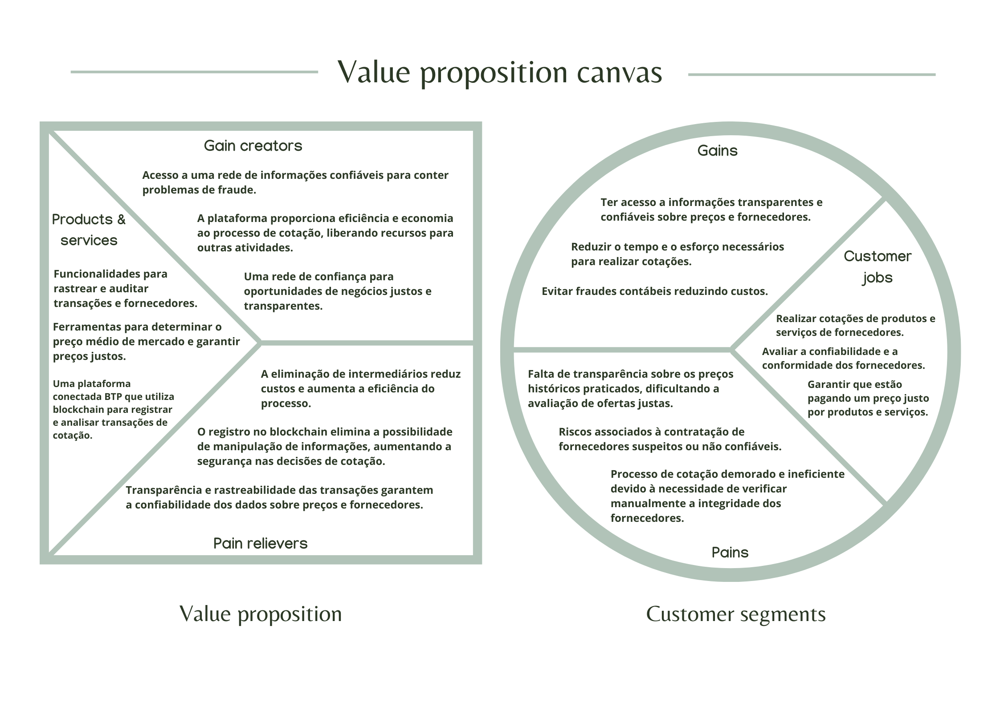
</div>
<h6 align="center"> Fonte: Elaborado pelos autores </h6>

&emsp;Ao aplicar o Value Proposition Canvas ao projeto, torna-se claro como as diferentes partes interessadas serão beneficiadas e como o projeto pode atender às suas necessidades específicas.<p>
&emsp;Podemos identificar os segmentos de cliente envolvidos no processo de cotação de fornecedores, compreender suas dores e ganhos, e definir uma proposta de valor que aborde diretamente esses pontos. Para os compradores, que enfrentam problemas como a falta de transparência nos preços e a presença de fornecedores suspeitos, a proposta de valor do projeto oferece transparência total nas transações e eficiência no processo de cotação. Para os fornecedores, a proposta de valor inclui acesso a uma rede de informações confiáveis e a oportunidade de oferecer produtos e serviços em um ambiente transparente e seguro.<p>

## 1.2. Matriz Oceano Azul

&emsp;A seção a seguir se trata da matriz oceano azul, um processo muito importante na construção de soluções que buscam inovar o mercado e explorar setores que estão com dores ainda não atendidas por outros produtos. Esse setor não abrangido pelo mercado é chamado de Oceano Azul, enquanto o atendido é chamado de Oceano Vermelho (por conta da quantidade de concorrentes), segundo os escritores Renée Mauborgne e W. Chan Kim. Por fim, a matriz tem por vez a função de pontuar de maneira objetiva os atributos dos outros produtos no mercado e definir quais deles devemos eliminar, diminuir, aumentar e criar, para que assim o produto chegue ao usuário que mais necessita de maneira inovadora.<p>

&emsp;Na tabela 1, são apresentadas algumas soluções já implementadas no mercado, juntamente com seus principais atributos, em comparação com nosso produto, Chain Sync. Cada valor atribuído na tabela representa o nível de satisfação do cliente, variando de 1 (extremamente insatisfeito) a 10 (extremamente satisfeito). As notas fornecidas em cada atributo são baseadas em comentários e relatos de empresas clientes. As empresas em questão são: <p>

&emsp;Thomasnet: Uma plataforma online que fornece informações detalhadas sobre fornecedores industriais, produtos e serviços. É amplamente reconhecida por sua base de dados abrangente e recursos de pesquisa avançados.<p>

&emsp;Alibaba: Uma plataforma de comércio eletrônico global que conecta compradores e vendedores de todo o mundo. Possui uma vasta gama de produtos disponíveis e é conhecida por oferecer preços competitivos.<p>

&emsp;Global Sources: Uma plataforma online que facilita o comércio global, fornecendo informações sobre fornecedores, produtos e serviços. É conhecida por sua ampla rede de fornecedores e recursos de pesquisa avançados.<p>

<h6 align="center"> Tabela 1:  Matriz Oceano Azul </h6>

<div align="center">
	
| Atributo | Chain Sync | Thomasnet | Alibaba | Global Sources |
|----------|-----------|------|-----|-------|
|Preço|   10   |   7   |   6   |   5   |
|Confiabilidade|   9   |   6   |   7   |   7   |
|Tecnologia|   9   |   6   |   8   |   7   |
|Competitividade|   1   |   7   |   7   |   6   |
|Comodidade|   5   |   7   |   6   |   8   |
|Praticidade|   8   |   6   |   7   |   7   |
|Anonimidade|   10   |   3   |   4   |   5   |
|Segurança de dados|   8   |   6   |   6   |   7   | 
</div>
<h6 align="center"> Fonte: Elaborado pelos autores </h6>

&emsp;A análise visa oferecer uma visão abrangente das forças e fraquezas de cada empresa em relação aos diferentes aspectos importantes na escolha de um serviço de cotação de fornecedores. Essas informações ajudam no mapeamento dos substitutos disponíveis no mercado e como fugir desse oceano vermelho e desbravar o oceano livre para a inovação.<p>
&emsp;Para uma melhor visualização dos dados,  o gráfico a seguir demonstra de forma mais clara a avaliação de valor do oceano azul.<p>
<h6 align="center"> Imagem 2: Gráfico Matriz Oceano Azul </h6>

<div align="center">
	
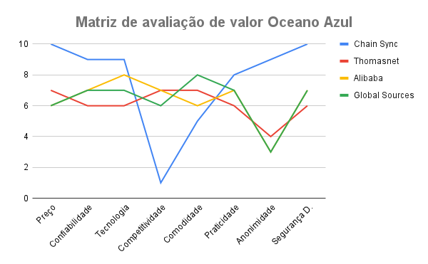 <p>
</div>
<h6 align="center"> Fonte: Elaborado pelos autores </h6>

&emsp;Com os dados apresentados é possível agora pontuar os atributos que foram escolhidos para serem modificados para buscar a inovação que vem junto do oceano azul:

&emsp;**Eliminar:** Com o objetivo do produto sendo em utilizar a blockchain para conseguir o preço médio do mercado de maneira cooperativa na rede, logo foi claro que se deveria eliminar o máximo possível da competitividade entre os usuários da rede, isso é, em relação a busca de informações confiáveis, uma vez que o chain sync vem para mudar isso. Além de gerar uma “coopetição”, termo utilizado no livro Theory of Games and Economic Behavior, de 1944.<p>
&emsp;**Diminuir:** Como dito anteriormente, por se tratar de uma rede de coopetição, a comodidade é outro ponto que é diminuído por não ser mais requerido dentro da blockchain, uma vez que todos os nós podem ser confiados sem a necessidade de criar-se uma comodidade entre os usuários. <p>
&emsp;**Aumentar:** Como observado no gráfico, diversos atributos foram alvos de aumento, isso acontece principalmente por conta da tecnologia implementada, que traz consigo diversos benefícios ao ser implementada. Entre os aumentos estão a confiabilidade, tecnologia, praticidade, segurança de dados e o preço, que o aumento dentro do gráfico significa satisfação do cliente.<p>
&emsp;**Criar:** Com a utilização da blockchain, foi criado um novo aspecto que os outros competidores não são capazes de fazerem também quanto a mesma é a questão da anonimidade dos usuários dentro da rede, assim mantendo seus segredos sem perder a credibilidade dos dados disponibilizados dentro da rede.

&emsp;Em resumo, os ajustes propostos na estratégia de inovação, conforme delineados nos atributos a serem eliminados, diminuídos, aumentados e criados, visam não apenas alavancar a competitividade no mercado, mas também promover uma nova dinâmica de cooperação e confiança entre os usuários da rede blockchain. Assim, ao adotar essas estratégias, não se busca apenas inovação, mas também redefine os padrões de interação e confiança na indústria.

## 1.3. Matriz de Riscos e Oportunidades

&emsp;A matriz de riscos desempenha um papel crucial na análise de riscos e oportunidades em um projeto. Por meio dela, a equipe pode identificar os aspectos críticos do projeto e, a partir dessa identificação, elaborar estratégias para evitar ou mitigar esses eventos adversos. O mesmo princípio se aplica às oportunidades; na matriz de oportunidades, são identificados os aspectos que podem ser explorados e maximizados ao longo do projeto.<p>

&emsp;A seguir, apresentamos a matriz de riscos e oportunidades desenvolvida pelo grupo em relação ao projeto:<p>

<h6 align="center"> Imagem 3: Matriz de Riscos e Oportunidades </h6>

<div align="center">
	
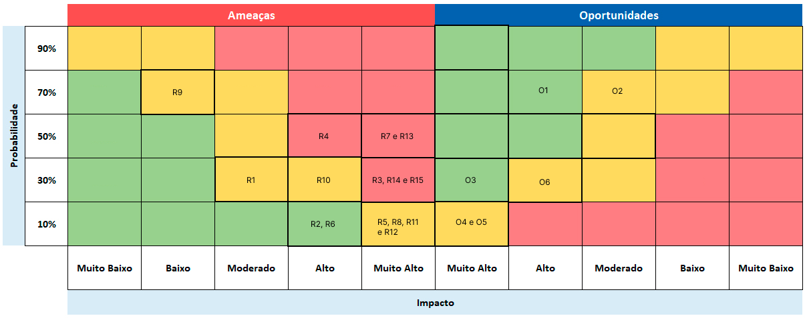
</div>

<h6 align="center"> Fonte: Elaborado pelos autores </h6>

&emsp;A matriz de riscos e oportunidades do grupo foi elaborada com base em três aspectos cruciais considerados como essenciais: (1) fatores que podem resultar em atraso na entrega; (2) elementos que podem culminar na **não** conclusão do projeto; (3) e fatores que poderiam provocar uma redução na qualidade.<p>

&emsp;Essa análise levou à identificação dos riscos considerados mais críticos para o projeto. Veja abaixo a conclusão:<p>

**Atraso na entrega:**<p>
R1: Subestimação do tempo necessário para completar as tarefas.

R2: Falta de alinhamento entre os integrantes do grupo sobre o que é a entrega.

R3: Recursos insuficientes para cumprir o cronograma.

R4: Problemas de comunicação entre os membros da equipe.

R14: Integrante ausente por motivos de saúde.

R15: Indisponibilidade do professor e mentor para auxiliar no projeto.

**Não conclusão do projeto:**<p>
R5: Mudanças significativas nos objetivos ou escopo do projeto.

R6: Desistência de membros-chave da equipe.

R7: Conflitos internos na equipe que levam à desmotivação

R8: Falta de comprometimento da alta administração - orientação/corpo docente/parceiro.

**Redução da qualidade proposta:**<p>
R9: Falta de compreensão dos requisitos do projeto desde o início.

R10: Alocação inadequada de recursos, resultando em trabalho de baixa qualidade.

R11: Falta de revisões e verificações de qualidade durante o desenvolvimento.

R12: Mudanças frequentes no planejamento da solução sem avaliação de impacto na qualidade.

R13: Falta de treinamento adequado para a equipe em relação à Cartesi.

&emsp;A mesma metodologia foi empregada para elaborar a matriz de oportunidades, agora direcionada para os três aspectos que o grupo de desenvolvimento pode capitalizar durante e após o processo de criação. Focamos em: (1) A dinâmica da equipe de desenvolvimento e (2) O potencial de impacto social e comunitário.<p>

&emsp;Ao analisarmos esses aspectos, chegamos às seguintes conclusões:<p>

**Em relação à equipe de desenvolvimento:**

O1: Há uma oportunidade para fortalecer a colaboração e coesão da equipe, o que resultará em maior eficiência e desempenho global.

O2: Existe a possibilidade de desenvolvimento de habilidades técnicas e interpessoais dos membros da equipe, contribuindo para seu crescimento profissional e pessoal.

O3: A equipe pode obter reconhecimento e visibilidade tanto dentro quanto fora da organização, aumentando sua reputação e suas oportunidades futuras.

**Potencial de impacto social e comunitário:**

O4: Há uma chance de contribuir para soluções inovadoras que beneficiem a comunidade ou a sociedade em geral, demonstrando o comprometimento da equipe.

O5: Existe a possibilidade de inspirar outros grupos ou indivíduos a se envolverem em projetos similares, ampliando o impacto positivo além das fronteiras da equipe.

O6: Pode-se promover valores éticos e sustentáveis no desenvolvimento do projeto, influenciando positivamente a percepção da equipe e da organização perante a sociedade.

&emsp;Com essa análise, vislumbramos oportunidades significativas para o crescimento e impacto do projeto.<p>

&emsp;Para finalizar, é essencial que a equipe esteja atenta a essas oportunidades e trabalhe de forma colaborativa para maximizar seu potencial e contribuir de maneira positiva para a comunidade e para o sucesso do projeto como um todo.<p>

# 2. Entendimento da Experiência do Usuário
<a id="entendimento-da-experiencia-do-usuario"></a>
&emsp;Em um mundo cada vez mais centrado no usuário, a compreensão e consideração da experiência do usuário (UX) emergiram como elementos críticos para o sucesso de qualquer empreendimento, especialmente no campo digital. Antes mesmo de iniciar qualquer operação direcionada ao usuário, é imperativo compreender o contexto em que ele se encontra. Afinal, a experiência do usuário não é apenas uma questão de design estético ou funcionalidade; trata-se de entender profundamente as necessidades, expectativas e desafios do usuário em um determinado contexto. Neste contexto, exploraremos a importância de adquirir uma compreensão sólida da experiência do usuário antes de iniciar qualquer operação em relação a ele, e como essa abordagem pode ser fundamental para o sucesso de produtos, serviços e experiências digitais.

## 2.1. Personas
&emsp;Personas são representações semifictícias de usuários reais que ajudam a adaptar as necessidades, objetivos e comportamentos de clientes potenciais para o. Indo mais fundo, pode-se dizer que as personas são desenvolvidas para melhorar a comunicação com os usuários e entender o posicionamento do produto no mercado. Assim, desempenham um papel vital na solução final, permitindo uma visualização mais ampla e clara do público-alvo, da sua demografia, preferências e desafios, contribuindo assim para projetos mais eficientes e que proporcionem a melhor experiência ao utilizador.<p>

<h6 align="center"> Imagem 4:  Persona 1 Júlia </h6>

<div align="center">
	
.png)
</div>

<h6 align="center"> Fonte: Elaborado pelos autores </h6>
&emsp;Julia Ferreira, diretora de operações e entusiasta da sustentabilidade aos 30 anos, é crucial para alinhar o projeto com práticas ecológicas e inovadoras. Sua abordagem focada em tecnologia e responsabilidade ambiental assegura que o projeto promova impacto positivo, eficiência e transparência. Com habilidades empreendedoras e resolução de problemas, Julia é essencial para conduzir o projeto a resultados sustentáveis e inovadores, garantindo sua viabilidade e sucesso.<p>
<h6 align="center"> Imagem 5:  Persona 2 Nelson </h6>

<div align="center">
	

</div>

<h6 align="center"> Fonte: Elaborado pelos autores </h6>
&emsp;Nelson Monteiro, aos 43 anos e especialista em blockchain, é chave para integrar segurança e inovação tecnológica ao projeto. Com seu foco em simplificar tecnologias complexas, ele assegura que o projeto atenda a padrões de eficiência e acessibilidade. Sua liderança e visão estratégica impulsionam o sucesso do projeto, adaptando soluções avançadas às necessidades do mercado.<p>

;&emsp;Como é possível ver nas imagens acima sobre as personas, elas tratam de dois usuários, o Nelson, sendo funcionário da Alliance, e a Júlia, sendo co-fundadora de uma startup e cliente da Alliance. O mapeamento deles tem uma grande importância para o iniciar do projeto, permitindo o entendimento das dores e necessidades de todos os usuários que irão utilizar da nossa plataforma, assim entregando uma nova visão de mercado do nosso produto.<p>

## 2.2. User Storys
&emsp;User Stories são descrições curtas e simples de uma funcionalidade contadas do ponto de vista da pessoa que deseja a nova capacidade, normalmente um usuário ou cliente do sistema. Elas são utilizadas para transmitir as necessidades e objetivos dos usuários finais de forma clara, concentrando-se no que é importante para a entrega de valor ao cliente. Assim, desempenham um papel crucial no desenvolvimento do produto, assegurando que as funcionalidades desenvolvidas estejam alinhadas com as necessidades dos usuários e contribuam para uma solução final mais eficaz e satisfatória.<p>

<h6 align="center"> Imagem 6:  User Story 1- Visualização de Transações </h6>

<div align="center">
	

</div>

<h6 align="center"> Fonte: Elaborado pelos autores </h6>

<h6 align="center"> Imagem 7:  User Story 2- Gerenciamento de Participantes na Blockchain </h6>

<div align="center">
	

</div>

<h6 align="center"> Fonte: Elaborado pelos autores </h6>

<h6 align="center"> Imagem 8:  User Story 3- Acesso a Relatórios Detalhados do Desempenho da Blockchain</h6>

<div align="center">
	

</div>

<h6 align="center"> Fonte: Elaborado pelos autores </h6>

<h6 align="center"> Imagem 9:  User Story 4- Sistema de Alerta </h6>

<div align="center">
	

</div>

<h6 align="center"> Fonte: Elaborado pelos autores </h6>

<h6 align="center"> Imagem 10:  User Story 5- Exibir o Preço Médio </h6>

<div align="center">
	

</div>

<h6 align="center"> Fonte: Elaborado pelos autores </h6>

<h6 align="center"> Imagem 11:  User Story 6- Implemetação de Soluções de Seguranças </h6>

<div align="center">
	

</div>

<h6 align="center"> Fonte: Elaborado pelos autores </h6>


&emsp;Conforme demonstrado nas descrições acima sobre as User Stories, elas tratam de funcionalidades importantes como a visualização de transações e o gerenciamento de participantes na blockchain. Essas histórias ajudam a compreender as necessidades e objetivos dos usuários finais que irão interagir com a plataforma, permitindo assim uma melhor visão de mercado e uma solução mais alinhada com as expectativas do usuário.<p>

# 3. Infraestrutura
<a id="infraestrutura"></a>
&emsp;Em um cenário em constante evolução de tecnologia blockchain, a infraestrutura desempenha um papel crucial no suporte e na otimização de aplicativos descentralizados. Essa infraestrutura não se limita apenas à rede em si, mas abrange uma série de componentes essenciais, desde a escolha da plataforma até a arquitetura de armazenamento de dados.

## 3.1. Arquitetura proposta Versão 1.0

&emsp;Uma arquitetura proposta representa um plano sugerido para organizar componentes, estruturas ou sistemas, com o intuito de atender de maneira eficiente aos requisitos e objetivos do cliente. Essa proposta delineia a interação entre os diferentes elementos da solução, proporcionando uma visão abrangente de como a solução funcionará, tanto para o grupo de desenvolvedores quanto para o cliente. Além disso, a arquitetura proposta desempenha um papel crucial ao mapear a localização das vulnerabilidades identificadas na análise de riscos, servindo como alicerce para o desenvolvimento de um plano de ação robusto que visa mitigar esses riscos.[1]<p>

<h6 align="center"> Imagem 12: Arquitetura proposta </h6>

<div align="center">
	
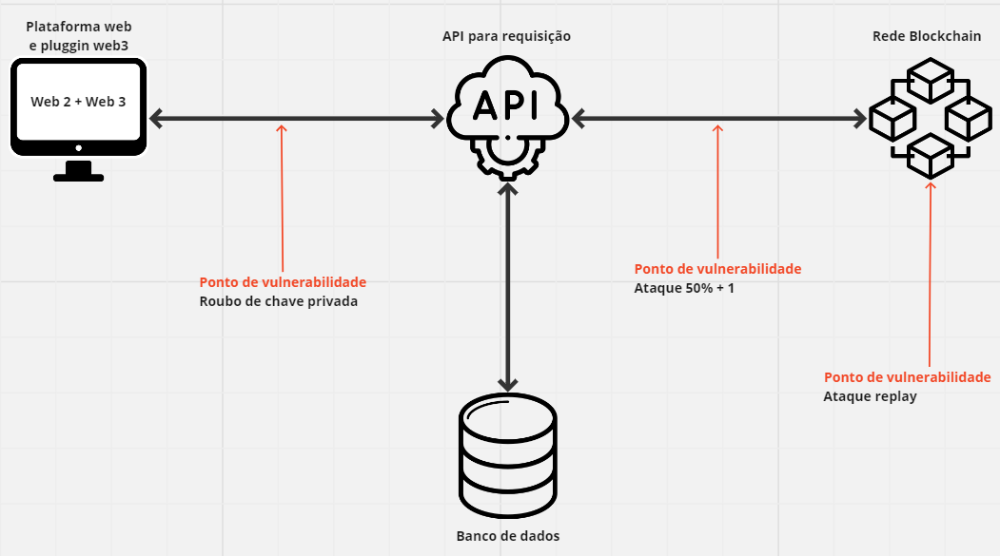
</div>

<h6 align="center"> Fonte: Elaborado pelos autores </h6>

&emsp;É importante ressaltar que a arquitetura proposta representa um esboço inicial, delineando a estrutura básica da solução. Contudo, ela está sujeita a refinamentos e ajustes à medida que o projeto evolui e suas necessidades são mais bem compreendidas. A arquitetura final será cuidadosamente moldada e alinhada de acordo com os requisitos específicos do projeto, visando alcançar sua versão mais otimizada e alinhada com as expectativas do cliente. Essa abordagem iterativa garante uma adaptação contínua e refinamento, permitindo que a arquitetura evolua de acordo com as nuances e demandas que surgem ao longo do desenvolvimento do projeto.<p>

### 3.1.1. Arquitetura proposta Versão 2.0

&emsp;Nesta seção, apresentamos uma nova versão da arquitetura proposta, concebida para fortalecer ainda mais a segurança da informação do projeto. Esta versão é fruto de refinamentos e análises adicionais, visando mitigar de forma mais eficaz as vulnerabilidades identificadas. Através desta arquitetura, com a introdução da tecnologia da Cartesi, a robustês computacional do projeto aumentou com a possibilidade de linguagens mais complexas e com muitas outras funções, além de minimizar o gasto com gas.<p>

<h6 align="center"> Imagem 13: Arquitetura proposta 2ª versão </h6>

<div align="center">
	
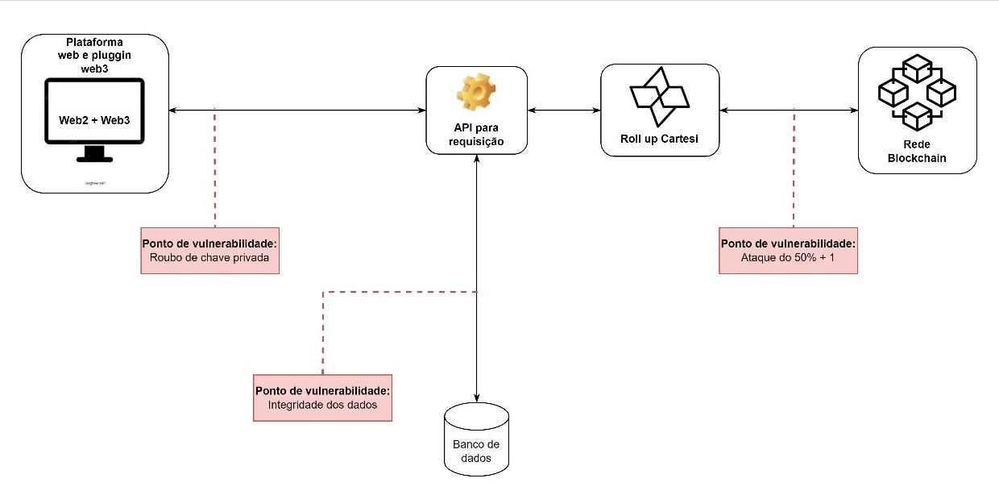
</div>

<h6 align="center"> Fonte: Elaborado pelos autores </h6>

&emsp;Na segunda versão da arquitetura proposta, a principal mudança foi a implementação da Cartesi, que atua como um roll up sobre a blockchain, permitindo uma prograação bem mais robusta e escalável do que a anterior. Além disso, não deixa de usufruir dos benefícios da blockchain.<p>

### 3.1.2. Arquiterura proposta Versão 3.0

&emsp;Por fim, temos a versão final da arquitetura proposta, que segure uma alteração em relação ao uso de um banco de dados. Essa versão foi concebida a partir de refinamentos e análises adicionais, visando otimizar a consulta de dados na solução e mitigar os riscos em relação a segurança dos dados. Com a implementação dessa nova arquietetura, a consulta de dados será feita diretamente na rede blockchain e não mais em um banco de dados análogo.

<h6 align="center"> Imagem 14: Arquitetura proposta 3ª versão </h6>

<div align="center">

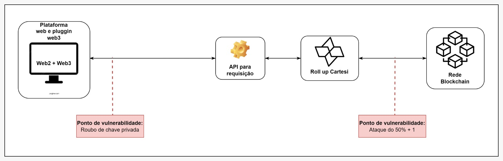
</div>

<h6  align="center"> Fonte: Elaborado pelos autores </h6>

&emsp;Ao remover o banco de dados de nossa solução blockchain, mitigamos os riscos associados aos ataques cibernéticos à bancos de dados convencionais no contexto do web2, que tende a ser mais vulnerável a tais ameaças. Essa abordagem não apenas fortalece a segurança de nossos dados, mas também alinha-se com os princípios de descentralização e imutabilidade inerentes à tecnologia blockchain, garantindo uma base mais robusta para nossas operações.

## 3.2. Diagrama de Blocos

&emsp;A seção subsequente aborda o conceito de diagrama de blocos, uma ferramenta crucial na representação visual de sistemas e processos. Por meio de blocos interconectados que simbolizam diferentes etapas ou componentes, esse diagrama oferece uma visão clara e estruturada de como os elementos de um sistema se relacionam e funcionam em conjunto. Cada bloco representa uma função específica ou um conjunto de atividades, permitindo uma análise detalhada e uma compreensão abrangente do sistema em questão. Ao identificar e descrever esses blocos de forma precisa, os profissionais podem melhorar a eficiência, otimizar processos e resolver problemas de maneira sistemática e organizada.<p>
	
&emsp;Na imagem 15 é apresentado o diagrama de blocos do projeto, contendo toda sequência de operações presente na aplicação e suas interações.<p>

<h6 align="center"> Imagem 15: Diagrama de Blocos </h6>

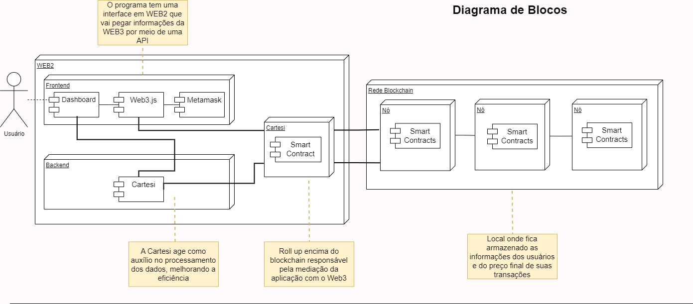

<h6 align="center"> Fonte: Elaborado pelos autores </h6>

**WEB2:**
	
&emsp;Esse bloco é todo espaço que a WEB2 contempla, sendo WEB2 a segunda geração de serviços da World Wide Web que se concentra na experiência do usuário e na participação ativa dos usuários. Basicamente, a maior parte da internet atualmente é baseada nela, assim sendo, por questão de usabilidade e de eficiência, os blocos de Frontend e Backend serão feitos dentro da WEB2.<p>

**Frontend**

&emsp;Esse bloco refere-se a interface da solução, onde os usuários podem interagir com a plataforma e ter acesso aos serviços propostos. O frontend é composto por 3 elementos: Dashboard - uma interface gráfica que exibe informações de maneira visual e consolidada, responsável por mostrar o preço médio para os usuários, sendo esses dados extraídos através de uma API no backend  -, Web3.js - biblioteca JavaScript que fornece uma interface de programação de aplicativos para interagir com a blockchain Ethereum. responsável por conectar nosso frontend com os Smart Contracts dentro da rede Blockchain - e as Wallets - serviço responsável por armazenar, receber e enviar criptomoedas, além de servir como identidade para a rede Blockchain.<p>

**Backend**

&emsp;Esse bloco refere-se a parte do software que lida com o processamento dos dados, a lógica de negócios, a comunicação com o banco de dados e a interação com os nós da rede Blockchain. Os componentes do Backend são: Banco de dados - responsável por armazenar informações dentro do WEB2 para garantir mais eficiência na aplicação - e API - responsável por fazer diferentes softwares se comunicarem e compartilharem dados de maneira padronizada.<p>

**Rede Blockchain**

&emsp;Esse bloco refere-se a principal tecnologia que será utilizada no projeto, responsável por registrar informações de maneira distribuída e pública para todos dentro do grupo criado pela Alliance, organizadas em blocos encadeados de forma cronológica e imutável. Seus componentes são: Nós - são os blocos que guardam informações citadas anteriormente, seguindo o preceito do blockchain - e Smart Contracts - contratos autoexecutáveis que são responsáveis por controlar ou documentar ações sob condições especificadas por meio de um código transparente e imutável.<p>

### 3.2.1. Atualização do diagrama

&emsp;Nesta atualização do diagrama de blocos, introduzimos uma modificação significativa para incorporar a tecnologia Cartesi, refletindo uma evolução crucial no projeto. A inclusão da Cartesi como componente central no bloco da Rede Blockchain representa um avanço fundamental, permitindo a execução de computação off-chain dentro de contratos inteligentes, ampliando as capacidades e possibilidades do sistema. Essa atualização visa proporcionar uma representação mais abrangente e precisa das operações do projeto, garantindo que todas as inovações tecnológicas sejam adequadamente refletidas e compreendidas.<p>

<h6 align="center"> Imagem 16: Diagrama de Blocos Versão 2</h6>

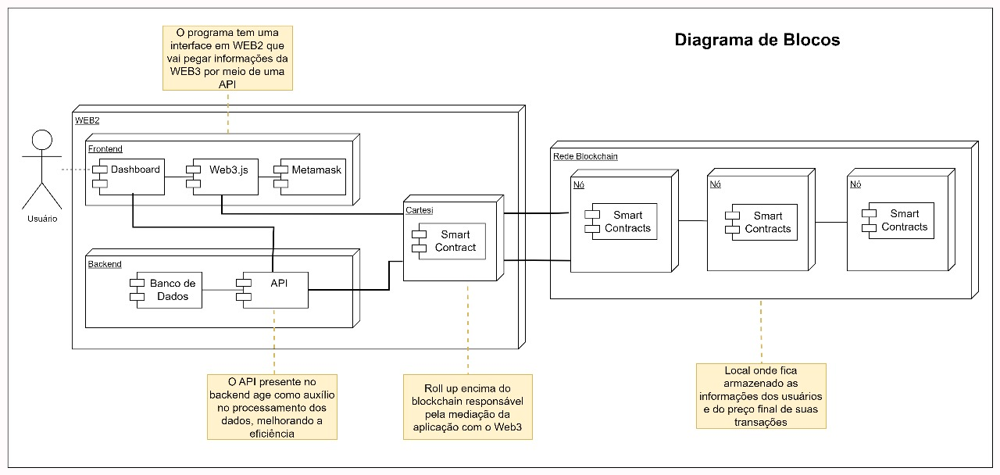 <p>

<h6 align="center"> Fonte: Elaborado pelos autores </h6>

**Conclusão**

&emsp;Com o diagrama de blocos montado e explorado de maneira mais detalhada, é possível seguir para os próximos passos do projeto sempre visando um norte e com uma ideia geral de como todas as partes devem interagir entre si para não gerar futuros gargalos e facilitar possíveis correções de erros.<p>

### 3.2.2. Diagrama de Implantação

&emsp;O diagrama de implantação UML é uma representação visual que descreve a arquitetura física de um sistema, mostrando como os componentes de software e hardware são distribuídos em diferentes nós de implantação, como servidores e dispositivos físicos. Ele ilustra as relações entre esses nós, indicando como os componentes são distribuídos e interagem entre si na infraestrutura física, facilitando a compreensão da configuração e distribuição do sistema em um ambiente de implantação real.<p>

&emsp;Na imagem xx é apresentado o diagrama de implantação do projeto, contendo todas as aplicação e suas hospedagens.<p>

<h6 align="center"> Imagem 17: Diagrama de Blocos Versão 2</h6>

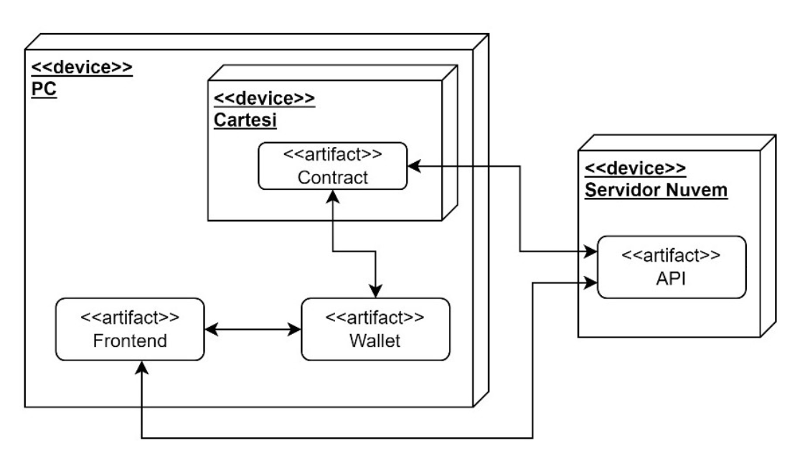 <p>

<h6 align="center"> Fonte: Elaborado pelos autores </h6>  

&emsp;Antes de explicar cada elemento presente no diagrama é valido salientar a definição das classificações dos obejtos presentes na imagem. Os "Artifacts" são as ferramentas, ou seja, os softwares que estão sendo utilizados, enquanto os "Devices" são onde os artefatos estão hospedados e fazendo sua função.
<p>

**Device: PC**

&emsp;O device PC é o local onde grande parte dos artefatos do projeto estão hospedados, sendo o "PC" o computador do usuário, em que estarão rodando o "artifact" Frontend, responsável pela interface da plataforma e interação com a Wallet e o API. Mais informações relacionadas a ele estão disponibilizadas em sua própria sessão. Outro "artifact" presente no device é a Wallet, responsável por ser a identificação e o meio para transações através do blockchain. Possui conexões com o frontend e o smart contract da Cartesi.<p>

**Device: Cartesi**

&emsp;O device Cartesi é responsável por hospedar os smart contracts gerados pela aplicação e conecta-los com o blockchain, mais informações relacionadas ao Cartesi estão disponibilizados em sua própria seção deste documento. Ele está contido no device PC e faz concexões com a wallet e com a API do servidor nuvem.<p>

**Device: Servidor Nuvem**

&emsp;O device Servidor nuvem é responsável por hospedar os artifacts banco de dados e a API da solução, na qual o banco de dados interage com a API e esta interage com os smart contracts e com o frontend, possibilitando o fluxo dentro do projeto como um todo. Para possibilidades de servidor nuvem tem várias opções no mercado que são amplamente utilizadas e renomadas, sendo assim, fica de escolha do cliente a hospedagem preferida.<p>

**Conclusão**

&emsp;Com a disponibilidade do diagrama de Implantação, a visualização da estrutura da solução e sua hospedagem após entrar em operação ficam mais claras, e assim, mais fáceis de serem preparadas e feita as possíveis alterações e manutenções.<p>

## 3.3. Diagramas UML
<a id="diagramas-uml"></a>

&emsp;O diagrama de sequência UML é uma ferramenta gráfica utilizada no desenvolvimento de softwares para representar a interação entre as partes que compõem o sistema. Ele descreve como as diferentes partes de um sistema colaboram para realizar um conjunto específico de ações. O objetivo principal do diagrama de sequência é visualizar e compreender o fluxo de mensagens entre os objetos durante a execução de um cenário particular.
Em relação às regras de negócio especificamente, o diagrama de sequência desempenha um papel crucial ao ajudar a entender como as classes e objetos do sistema se comunicam para atender aos requisitos estabelecidos pelas regras de negócio. Ele proporciona uma visão detalhada das interações entre os componentes do sistema, identificando as mensagens trocadas, a ordem em que ocorrem e os eventos desencadeados.<p>

&emsp;A seguir é possível ver os diagramas de sequência desenvolvidos para atender as regras de negócio desse projeto:<p>

## 3.3.1. Diagrama UML da 1ª regra de negócio

<h6 align="center"> Imagem 18: Diagrama UML - 1º Regra de negócio </h6>

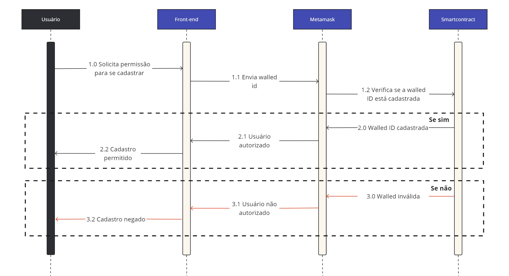 <p>

<h6 align="center"> Fonte: Elaborado pelos autores </h6>

&emsp;O diagrama de sequência acima é composto das seguintes etapas:<p>

&emsp;1.0: O usuário solicita seu permissão para se cadastrar na plataforma, por meio da inserção de suas informações no frontend. <p>
&emsp;1.1: O frontend será responsável por guardar a wallet id cadastrada, que será o parâmetro usado para verificação do usuário, e envia essa informação para o pluggin metamask.<p>
&emsp;1.2: Por sua vez, o pluggin fará a comunicação com o smartcontract e verificará se a walled id está cadastrada na lista de autorizados a adentrar a plataforma ou não.<p>

&emsp;2.0: Caso a walled id esteja cadastrada, o smartcontract retornará para o pluggin metamask essa informação. <p>
&emsp;2.1: Que por sua vez, será responsável por comunicar ao frontend que aquele usuário está autorizado a se cadastrar. <p>
&emsp;2.2: Após todas essas etapas, o frontend retornará ao usuário a resposta de que seu cadastro foi autorizado, permitindo então que o usuário tenha acesso a plataforma.

&emsp;3.0: Caso a walled id não esteja cadastrada, o smartcontract retornará para o pluggin metamask essa informação. <p>
&emsp;3.1: Que por sua vez, será responsável por comunicar ao frontend que aquele usuário não deve ser autorizado a se cadastrar. <p>
&emsp;3.2: Após todas essas etapas, o frontend retornará ao usuário a resposta de que seu acesso não foi autorizado, negando seu cadastro na plataforma e aos dados que nela estão.<p>

## 3.3.2. Diagrama UML da 2ª regra de negócio

<h6 align="center"> Imagem 19: Diagrama UML - 2ª Regra de negócio </h6>

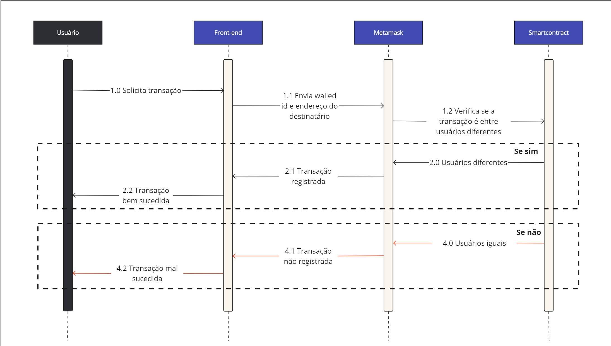 <p>

<h6 align="center"> Fonte: Elaborado pelos autores </h6>

&emsp;1.0: O usuário solicita uma transação por meio da rede blockchain, para isso utiliza sua wallet id e o endereço do destinatário.<p>
&emsp;1.1: O frontend será responsável por enviar a wallet id junto do endereço do destinatário, que serão os parâmetros usados para verificação da viabilidade da transação, e envia essa informação para o pluggin metamask. <p>
&emsp;1.2: Por sua vez, o pluggin fará a comunicação com o smartcontract e verificará se a transação é entre usuários diferentes.<p>

&emsp;2.0: Caso a transação for entre usuários diferentes, o smartcontract retorna essa informação para o metamask.<p>
&emsp;2.1: Quando o metamask recebe a informação do smartcontract ele registra a transação e retorna para o frontend a confirmação.<p>
&emsp;2.2: Após todas as etapas, o frontend retornará ao usuário a informação que a sua transação foi bem sucedida, dando fim ao processo.<p>

&emsp;3.0: Caso a transação for entre usuários iguais, o smartcontract retorna essa informação para o metamask.<p>
&emsp;3.1: Quando o metamask recebe a informação do smartcontract ele não registra a transação e reporta para o frontend o ocorrido.<p>
&emsp;3.2: Após todas as etapas, o frontend retornará ao usuário a informação que a sua transação foi mal sucedida, dando fim ao processo.<p>

## 3.3.3. Diagrama UML da 3ª regra de negócio

<h6 align="center"> Imagem 20: Diagrama UML - 3ª Regra de negócio </h6>

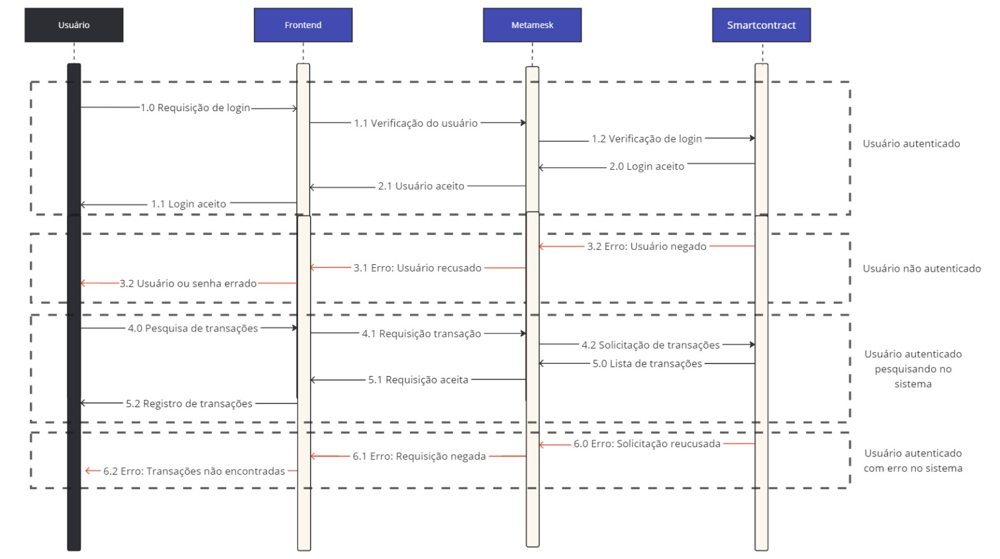 <p>

<h6 align="center"> Fonte: Elaborado pelos autores </h6>

&emsp;1.0 Usuário solicita login na plataforma via frontend.<p>
&emsp;1.1 Frontend autentica usuário utilizando Metamask.<p>
&emsp;1.2 Metamask verifica informações do usuário com o smart contract.<p>

&emsp;2.0 Smart contract valida informações e notifica Metamask.<p>
&emsp;2.1 Metamask autoriza acesso e comunica ao frontend.<p>
&emsp;2.2 Frontend confirma ao usuário o acesso concedido.<p>

&emsp;3.0 Smart contract rejeita informações e informa Metamask.<p>
&emsp;3.1 Metamask nega acesso e relata ao frontend.<p>
&emsp;3.2 Frontend informa ao usuário sobre o acesso negado.<p>

&emsp;4.0 Usuário autorizado busca transações no sistema.<p>
&emsp;4.1 Frontend requisita detalhes de transações via Metamask.<p>
&emsp;4.2 Metamask solicita informações de transações ao smart contract.<p>

&emsp;5.0 Smart contract fornece informações de transações à Metamask.<p>
&emsp;5.1 Metamask envia informações das transações ao frontend.<p>
&emsp;5.2 Frontend exibe informações das transações ao usuário.<p>

&emsp;6.0 Smart contract nega solicitação de transações e informa Metamask.<p>
&emsp;6.1 Metamask relata falha de pesquisa ao frontend.<p>
&emsp;6.2 Frontend notifica usuário da impossibilidade de encontrar transações.<p>

## 3.3.4. Diagrama UML do registro de um usuário

<h6 align="center"> Imagem 21: Diagrama UML - Registro de usuário </h6>

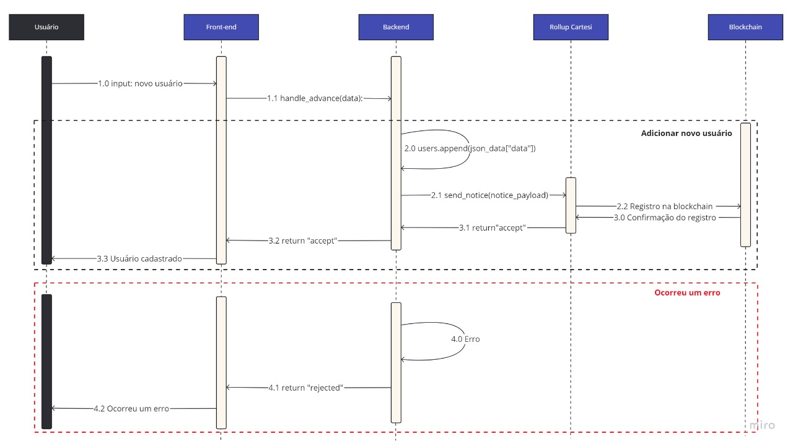 <p>

<h6 align="center"> Fonte: Elaborado pelos autores </h6>

&emsp;1.0 O owner envia por meio de um input uma solicitação de resgistro de um novo usuário através do front-end.<p>
&emsp;1.1 Frontend envia por meio do handle_advance as informações enviadas pelo usuário para o backend.<p>

&emsp;2.0 Se não houver problemas o backend adiciona o novo usuário a lista de cadastrados.<p>
&emsp;2.1 O backend se comunica com a Cartesi para registrar o novo usuário na rede.<p>
&emsp;2.2 A Cartesi se comunica com a blockchain para registrar o usuário dentro da rede blockchain.<p>

&emsp;3.0 A blockchian retorna para a Cartesi a confirmação do registro.<p>
&emsp;3.1 Por usa vez a Cartesi retorna o sucesso da operação para o backend.<p>
&emsp;3.2 O backend retorna ao frontend que a operação foi realizada com sucesso.<p>
&emsp;3.3 O frontend retorna para o usuário que o cadastro foi um sucesso.<p>

&emsp;4.0 Caso de erro na operação ela é pausada.<p>
&emsp;4.1 O backend retorna para o frontend que a operação foi rejeitada.<p>
&emsp;4.2 O frontend retorna ao usuário que ocorreu um erro na operação.<p>


## 3.3.5. Diagrama UML do registro de uma transação

<h6 align="center"> Imagem 22: Diagrama UML - Registro de transação </h6>

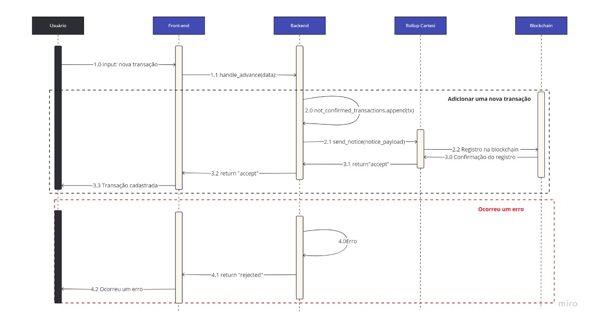 <p>

<h6 align="center"> Fonte: Elaborado pelos autores </h6>

&emsp;1.0 O owner envia por meio de um input uma solicitação de resgistro de uma nova transação através do front-end.<p>
&emsp;1.1 Frontend envia por meio do handle_advance as informações enviadas pelo usuário para o backend.<p>

&emsp;2.0 Se não houver problemas o backend adiciona a nova transação a lista de transaçõe não confirmadas.<p>
&emsp;2.1 O backend se comunica com a Cartesi para registrar a nova solicitação de transação na rede.<p>
&emsp;2.2 A Cartesi se comunica com a blockchain para registrar a solicitação de transação dentro da rede blockchain.<p>

&emsp;3.0 A blockchian retorna para a Cartesi a confirmação do registro.<p>
&emsp;3.1 Por usa vez a Cartesi retorna o sucesso da operação para o backend.<p>
&emsp;3.2 O backend retorna ao frontend que a operação foi realizada com sucesso.<p>
&emsp;3.3 O frontend retorna para o usuário que o cadastro da transação foi um sucesso e que é necessário a assinatura do outro integrante.<p>

&emsp;4.0 Caso de erro na operação ela é pausada.<p>
&emsp;4.1 O backend retorna para o frontend que a operação foi rejeitada.<p>
&emsp;4.2 O frontend retorna ao usuário que ocorreu um erro na operação de registro de transação.<p>

## 3.3.6. Diagrama UML da confirmação de uma transação

<h6 align="center"> Imagem 23: Diagrama UML - Confirmação de transação </h6>

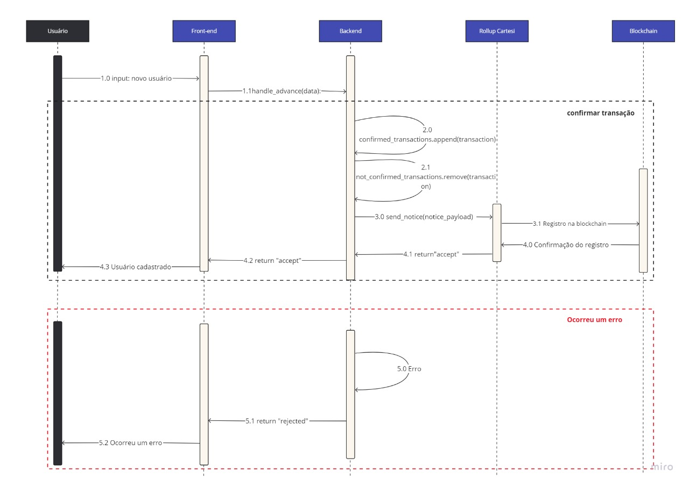 <p>

<h6 align="center"> Fonte: Elaborado pelos autores </h6>

&emsp;1.0 O usuário envia por meio de um input um resgistro de uma nova transação através do front-end.<p>
&emsp;1.1 Frontend envia por meio do handle_advance as informações enviadas pelo usuário para o backend necessárias para a operação.<p>

&emsp;2.0 Se não houver problemas o backend adiciona a nova transação a lista de transações confirmadas.<p>
&emsp;2.1 O backend também remove a transação da lista das não confirmadas.<p>

&emsp;3.0 A Cartesi se comunica com a blockchain para registrar a transação dentro da rede.<p>
&emsp;3.1 Por usa vez a Cartesi envia as informações necessárias para o registro da transação já assinada por ambas as partes.<p>


&emsp;4.0 A blockchain retorna para a Cartesi a confirmação do registro<p>
&emsp;4.1 A Cartesi retorna para o backend a confirmação da operação.<p>
&emsp;4.2 O backend por sua vez retorna para o frontend o sucesso da operação.<p>
&emsp;4.3 O frontend retorna ao usuário que a transação foi confirmada e já está registrada.<p>

**Conclusão**

&emsp;Ao deter os diagramas UML, é possível realizar uma análise mais detalhada do fluxo e das etapas de cada processo, proporcionando uma visão clara das interações e estruturas do sistema. Essa compreensão aprofundada não só facilita a identificação de áreas para futuras modificações e correções, mas também estabelece um registro documentado do histórico de fluxos, permitindo uma melhor gestão e evolução do sistema ao longo do tempo.<p>

## 3.4. Cartesi
&emsp;O Cartesi é uma infraestrutura de blockchain que possibilita o desenvolvimento de aplicações descentralizadas (DApps) complexas, oferecendo uma ponte entre a Web 2.0 e a tecnologia blockchain. No nosso projeto, a importância do Cartesi é evidenciada pelas seguintes funcionalidades e integrações:

**1. Metamask Integration:** Utilizamos o Metamask, uma carteira de criptomoedas, para permitir que os usuários interajam com a nossa aplicação de maneira segura e descentralizada. Através da integração do Metamask, facilitamos o registro de wallets dos usuários, o que é essencial para a execução de transações na blockchain.

**2. Interactions with Cartesi Rollups:** A nossa plataforma aproveita os Rollups do Cartesi para realizar operações complexas off-chain, mantendo a segurança e a imutabilidade proporcionadas pela blockchain. Isso é fundamental para registrar transações de maneira eficiente, sem comprometer a velocidade ou incorrer em altos custos de gas.

**3. Envio e Registro de Dados:** Por meio das funcionalidades oferecidas pelo Cartesi, como o envio de estados de inspeção (Inspect state Requests) e o registro de relatórios (Listing Reports), conseguimos manter um histórico transparente e acessível de todas as transações e previsões de preços realizadas na plataforma. Isso permite uma análise detalhada dos preços médios dos produtos e contribui para a confiabilidade e precisão das nossas previsões.

&emsp;Em resumo, a integração do Cartesi em nosso projeto oferece uma solução robusta e escalável, combinando o poder de computação off-chain com a segurança e transparência da tecnologia blockchain. Esta abordagem não apenas otimiza o processamento e registro de transações, mas também oferece uma plataforma mais acessível e eficiente para os usuários finais.

## 4. Regras de Negócios
<a id="regras-de-negocio"></a>
&emsp;Regras de negócios são declarações que definem ou regulam o comportamento, as políticas ou os procedimentos dentro de uma organização. Elas são essenciais para garantir que o sistema ou projeto atenda aos requisitos e objetivos específicos do negócio.<p>

## 4.1. Regras Definidas

&emsp;Um dos requisitos do projeto é a necessidade de a aplicação garantir a anonimidade das partes envolvidas em uma transação. Isso faz com que os stakeholders do projeto, tanto a empresa parceira (Alliance) quanto os usuários, fiquem satisfeitos e protejam suas informações diante do compartilhamento das mesmas.<p>

&emsp;Abaixo, temos uma tabela elencando as principais características dessa regra de negócio:<p>

<h6 align="center"> Tabela 2: Primeira Regra de Negócio </h6>

| Identificador  | RN01 |
| --- | --- |
| Nome | Somente usuários conseguem registrar transações |
| Módulo | Registro de transações |
| Data | 27/02/2024 |
| Autor | Sophia Leite da Nóbrega |
| Data da ultima atualização | 27/02/2024 |
| Autor da ultima atualização | Sophia Leite da Nóbrega |
| Versão | 1.0 |
| Dependências | - |
| Descrição | O sistema deve verificar se as transações estão sendo feitas entre dois Wallet IDs da rede. Caso ele verifique que as transações não estão sendo feitas pelos usuários da rede, ela é cancelada. |
| Caminho do Arquivo | codigo/ChainSync.sol |
| Função no Smart Contract | registerTransaction - require |
| Linha no Código | 37 |
<h6 align="center"> Fonte: Elaborado pelos autores </h6>

<h6 align="center"> Tabela 3: Segunda Regra de Negócio </h6>

| Identificador  | RN02 |
| --- | --- |
| Nome | Apenas o proprietário pode cadastrar novos usuários  |
| Módulo | Cadastro de Usuários |
| Data | 27/02/2024 |
| Autor | Rafaella Bianca Cavalcante |
| Data da ultima atualização | 03/03/2024 |
| Autor da ultima atualização | Sophia Leite da Nóbrega |
| Versão | 2.0 |
| Dependências | - |
| Descrição | A regra estabelece que apenas pessoas autorizadas podem cadastrar novos usuários na plataforma. Durante o processo de cadastro, o sistema deve verificar a autorização do cadastrador. Se o cadastrador não estiver autorizado, o sistema deve recusar o cadastro e exibir uma mensagem explicativa. |
| Caminho do Arquivo | codigo/ChainSync.sol |
| Função no Smart Contract | registerUser |
| Linha no Código | 35 |
<h6 align="center"> Fonte: Elaborado pelos autores </h6>

<h6 align="center"> Tabela 4: Terceira Regra de Negócio </h6>

| Identificador  | RN03 |
| --- | --- |
| Nome | Visualização de transações para usuários cadastrados |
| Módulo | Segurança de acesso |
| Data | 03/03/2024 |
| Autor | Enzo Boccia  |
| Data da ultima atualização | 03/03/2024 |
| Autor da ultima atualização | Sophia Leite da Nóbrega |
| Versão | 2.0 |
| Dependências | - |
| Descrição | Apenas usuários castrados e autenticados devem poder visualizar as transações na plataforma. Caso um usuário não cadastrado tente visualizar uma transação, o sistema deve bloquear a tela e exibir uma mensagem informando que apenas usuários cadastrados tem permissão e a tentativa será registrada. |
| Arquivo | codigo/ChainSync.sol |
| Função no Smart Contract | getAllTransaction |
| Linha no Código | 55 |
<h6 align="center"> Fonte: Elaborado pelos autores </h6>

<h6 align="center"> Tabela 5: Quarta Regra de Negócio </h6>

| Identificador  | RN04 |
| --- | --- |
| Nome | Evitar transações entre a mesma entidade  |
| Módulo | Função no Smart Contract |
| Data | 27/02/2024 |
| Autor | Rafaella Bianca Cavalcante |
| Data da última atualização | 03/03/2024 |
| Autor da última atualização | Sophia Leite da Nóbrega |
| Versão | 2.0 |
| Dependências | - |
| Descrição | A regra estabelece que transações entre a mesma entidade devem ser evitadas no sistema. Durante a execução da função `registerTransaction` no smart contract, o sistema deve verificar se o usuário comprador e o usuário vendedor são a mesma pessoa. Se for identificado que a transação está sendo feita pela mesma entidade, o sistema deve recusar a transação e exibir uma mensagem explicativa. |
| Caminho do Arquivo | codigo/ChainSync.sol |
| Função no Smart Contract | registerTransaction |
| Linha no Código | 38 |
<h6 align="center"> Fonte: Elaborado pelos autores </h6>

## 4.2. Exemplos e Cenários

&emsp;Vamos agora dar uma olhada em alguns possíveis cenários para cada uma das regras de negócio elencadas acima, serão considerados cenários onde a regra de negócio: não é respeitada (S01), é respeitada (S02) e quando há conflito com outras regras de negócio (S03).<p>

### RN01 - Somente usuários conseguem registrar transações

**S01 - Não é respeitada:**

&emsp;Um usuário que não faz parte da rede tenta registrar uma transação. O sistema não valida essa condição e registra a transação, violando a regra de negócio.<p>

**S02 - É respeitada:**

&emsp;Quando um usuário que não faz parte da rede tenta registrar uma transação, o sistema invalida a condição e não registra conforme esperado, mantendo a consistência.<p>

**S03 - Conflito com outras regras de negócio:**

&emsp;Se um usuário não autorizado tenta realizar uma transação, além de violar RN01, o sistema deve cancelar a transação e notificar sobre a violação de RN01. No entanto, se o usuário autorizado tenta realizar uma transação entre duas carteiras com o mesmo ID (violação de RN04), o sistema deve primeiro detectar a violação de RN04 e, em seguida, cancelar a transação, destacando como a conformidade com uma regra pode ser afetada por violações de outras regras de negócio.<p>

### RN02 - Apenas usuários autorizados podem realizar o cadastro na plataforma

**S01 - Não é respeitada:**

&emsp;Um cadastrador não autorizado tenta registrar um novo usuário na plataforma, mas o sistema permite o registro sem validar sua autorização. Isso resulta em cadastradores não autorizados tendo acesso aos recursos da plataforma, o que pode comprometer a segurança e a confidencialidade dos dados.<p>

**S02 - É respeitada:**

&emsp;Quando um cadastrador autorizado tenta registrar um novo usuário na plataforma, o sistema valida sua autorização e permite o registro. Isso garante que apenas cadastradores autorizados tenham acesso aos recursos da plataforma, mantendo a segurança e a integridade dos dados.<p>

**S03 - Conflito com outras regras de negócio:**

&emsp;Se um usuário não autorizado registra um novo usuário que tenta realizar transações não autorizadas (violando RN01), o sistema deve cancelar a transação e notificar sobre a violação de RN01. Além disso, se o usuário autorizado tenta cadastrar uma entidade que já possui um usuário existente (violação de RN04), o sistema deve detectar a violação de RN04 e cancelar o cadastro, ilustrando como violações de uma regra podem resultar em conflitos complexos.<p>

### RN03 - Visualização de transações para usuários cadastrados

**S01 - Não é respeitada:**

&emsp;Um usuário não cadastrado tenta visualizar as transações na plataforma, mas o sistema permite o acesso e exibe as informações das transações. Isso compromete a segurança dos dados e a privacidade dos usuários, violando a política de acesso apenas para usuários cadastrados.<p>

**S02 - É respeitada:**

&emsp;Quando um usuário cadastrado tenta visualizar as transações na plataforma, o sistema valida sua autenticação e autorização e permite o acesso às informações das transações. Isso garante que apenas usuários cadastrados tenham acesso aos registros financeiros, mantendo a confidencialidade dos dados.<p>

**S03 - Conflito com outras regras de negócio:**

&emsp;Se um usuário cadastrado tenta realizar uma transação não autorizada (violando RN01), o sistema deve bloquear o acesso às transações e notificar sobre a violação de RN01. Além disso, se o usuário autorizado tenta visualizar transações entre entidades proibidas (violação de RN04), o sistema deve detectar a violação de RN04 e bloquear o acesso, evidenciando como diferentes regras podem interagir.<p>

### RN04 - Evitar transações entre a mesma entidade

**S01 - Não é respeitada (S01):**
**S01 - Não é respeitada:**

&emsp;Um usuário tenta registrar uma transação entre duas carteiras com o mesmo ID. O sistema não valida essa condição e registra a transação, violando a regra de negócio. 

**S02 - É respeitada (S02):**
**S02 - É respeitada:**

&emsp;Quando um usuário tenta registrar uma transação entre duas carteiras com IDs diferentes, o sistema valida a transação e a registra conforme esperado, mantendo a consistência.

**S03 - Conflito com outras regras de negócio:**

&emsp;Se um usuário não autorizado tenta realizar transações entre entidades, o sistema deve cancelar a transação (violação de RN02) e, se necessário, bloquear o acesso às transações (violação de RN03), enfatizando como a conformidade com uma regra pode ser afetada por violações de outras regras de negócio.<p>

**Conclusão**

&emsp;As regras de negócio são uma parte fundamental do projeto, pois estabelecem os princípios e diretrizes que guiam o funcionamento e as interações dentro de um sistema ou organização. Elas definem as condições, restrições e comportamentos esperados em determinados cenários de negócio, garantindo consistência, conformidade e eficiência nas operações. Além disso, as regras de negócio são essenciais para alinhar as expectativas dos stakeholders e as necessidades dos usuários finais, contribuindo para o sucesso do projeto ao garantir que as funcionalidades e processos atendam aos objetivos e requisitos estabelecidos.<p>

# 5. Análise de Risco (Segurança da Informação)
<a id="analise-de-risco"></a>
&emsp;Na era digital, onde os dados são ativos valiosos e a segurança da informação é uma preocupação primordial, a análise de risco desempenha um papel fundamental na proteção de sistemas e informações sensíveis. Este processo abrangente e contínuo envolve a identificação, avaliação e mitigação de potenciais ameaças e vulnerabilidades que podem comprometer a segurança das informações.

## 5.2. Requisitos de Segurança Selecionados:

### 5.2.1. Confidencialidade

&emsp;O princípio fundamental da confidencialidade é crucial para assegurar a privacidade e o controle sobre as informações pessoais. Ao redigir um e-mail, enviar uma mensagem ou utilizar qualquer meio de comunicação de uma pessoa para outra, nossa expectativa é que somente o destinatário pretendido tenha acesso a essas informações. Contudo, na realidade da internet, essa simplicidade é frequentemente desafiada, e entre o remetente e o destinatário, podem surgir diversas tentativas de interceptação por agentes mal-intencionados que desrespeitam esse princípio. [2] <p>
&emsp;No contexto empresarial, essa vulnerabilidade também se manifesta. Uma empresa pode buscar obter dados confidenciais de suas concorrentes, gerando prejuízos substanciais a estas. Essa violação de informações confidenciais pode acarretar uma série de consequências para a parte afetada, empresa titular dos dados, além de seus colaboradores e até mesmo os clientes finais. A exposição não autorizada desses dados a terceiros pode desencadear impactos significativos em toda a cadeia de stakeholders, amplificando a gravidade da situação. [2]<p>
&emsp;Um exemplo de infração desse princípio é o caso de 2018 da empresa Cambridge Analytica, que revelou uma grave violação de privacidade no Facebook. A empresa obteve ilegalmente dados de 50 milhões de usuários dos EUA por meio de um aplicativo de teste psicológico. O pesquisador Aleksandr Kogan coletou dados, violando as políticas do Facebook ao compartilhá-los com a Cambridge Analytica. O escândalo destaca a necessidade urgente de regulamentações mais rigorosas para proteger a privacidade dos usuários online e ressalta a importância da conscientização sobre o uso responsável das redes sociais. [3]
Em face desse desafio, é crucial tomarmos ações preventivas para proteger a confidencialidade das informações, tanto nas nossas interações diárias como na esfera empresarial. O episódio notável da Cambridge Analytica, em 2018, serve como alerta sobre os riscos reais de negligenciar a segurança da informação. A violação de privacidade, que revelou a obtenção ilegal de dados de milhões de usuários do Facebook, destaca a necessidade urgente de regras mais rígidas para proteger a privacidade online. Diante desse cenário, fica claro que entender como usar as redes sociais de maneira responsável é fundamental. É crucial encontrar um equilíbrio entre a conveniência digital e a preservação da confidencialidade.<p>

### 5.2.2. Integridade

&emsp;A integridade, um dos pilares essenciais da tecnologia blockchain, desempenha um papel crucial na asseguração de que os dados armazenados sejam confiáveis, precisos e imutáveis.[4] Essa característica fundamental implica que, uma vez que um dado é registrado na blockchain, sua modificação ou exclusão não pode ocorrer sem o conhecimento e a aprovação da maioria da rede[5]<p>
&emsp;Esta característica assume uma importância multifacetada. Em primeiro lugar, a integridade da blockchain atua como um alicerce que sustenta a confiabilidade das transações e registros armazenados. As partes envolvidas em uma transação podem confiar plenamente na autenticidade dos dados, ampliando assim a confiança depositada na tecnologia.[6]<p>
&emsp;Além disso, a precisão dos dados é de vital importância para a tomada de decisões informadas e para a execução eficiente de projetos que fazem uso da blockchain. A imutabilidade dos dados não apenas preserva a história do projeto, mas também impede qualquer tentativa de adulteração, possibilitando a realização de auditorias e análises de forma consistente e confiável. Nesse contexto, a tecnologia blockchain emerge como uma ferramenta essencial para garantir a integridade e segurança dos dados em diversos setores.[7]<p>

### 5.2.3. Autenticidade

&emsp;A autenticidade atua como uma linha de defesa crucial contra diversas ameaças no mundo digital. Ela protege contra fraudes e roubo de identidade, impedindo que indivíduos mal-intencionados se assumam como outras pessoas para acessar contas, realizar transações ou obter informações confidenciais [8]. Além disso, garante a integridade e confiabilidade dos dados, assegurando que não foram adulterados ou corrompidos durante a comunicação ou armazenamento [9]. <p>
&emsp;A autenticidade também é fundamental na prevenção de ataques cibernéticos, dificultando a ação de hackers que tentam invadir sistemas ou interceptar dados confidenciais [10]. Ao criar um ambiente seguro para transações digitais, como compras online e transferências bancárias, a autenticidade promove a confiança dos usuários e incentiva a participação na economia digital [11].<p>
&emsp;Em resumo, a autenticidade é um pilar fundamental da segurança da informação, proporcionando um ambiente digital mais seguro e confiável para todos . Investir em medidas de autenticação eficazes é essencial para construir um ambiente digital mais seguro e confiável para todos [12]. <p>
&emsp;Esse princípio é crucial para garantir a confiabilidade e a precisão das informações manipuladas no âmbito do projeto. Em especial, no contexto da web 2.0 e transações online, onde a manipulação de dados é constante, a preservação da integridade é essencial para evitar riscos associados a informações imprecisas ou manipuladas [13]. Assegurar que os dados permaneçam íntegros ao longo de seu ciclo de vida é fundamental para a tomada de decisões confiáveis e para manter a confiança dos usuários e stakeholders envolvidos no projeto. <p>

## 5.3. Vulnerabilidades Identificadas:

### 5.3.1. Ataque de 51%:

&emsp;Um ataque de 51% ocorre quando um único indivíduo ou grupo consegue controlar mais de 50% da taxa de hash de uma determinada rede blockchain. Essa situação permite que o atacante manipule as transações e altere os dados da blockchain sem necessitar da aprovação do restante da rede, o que pode gerar diversos danos para a solução que está sendo desenvolvida, como a manipulação dos valores das transações de forma maliciosa, por exemplo. Esse ataque ocorre diretamente na rede blockchain, onde estão armazenados os dados, por esse motivo é importante garantir e verificar que apenas autorizados estão tendo acesso à rede.[14]<p>
&emsp;Vale ressaltar que esse ataque é comumente identificado como "Ataque de 51%", mas quando pensamos matematicamente, uma proporção de 50% + 1 seria o mais correto.<p>

**Impacto: Alto**

&emsp;Um ataque de 51% tem um impacto considerável, pois permite ao atacante comprometer a integridade das transações e dos dados armazenados na blockchain. A possibilidade de manipulação maliciosa e a potencial quebra da confiança na rede contribuem para o alto impacto dessa ameaça.<p>

**Probabilidade: Baixa**

&emsp;A probabilidade desse tipo de ataque ocorrer é considerada baixa, dada a complexidade técnica e os recursos necessários para controlar mais da metade da taxa de hash de uma rede. No entanto, é uma ameaça que deve ser monitorada e mitigada devido às consequências graves caso ocorra.<p>

**Requisitos de Segurança Afetados: Confidencialidade, Integridade**

&emsp;Esse tipo de ataque compromete tanto a confidencialidade quanto a integridade dos dados na blockchain. A confidencialidade é ameaçada pela capacidade do atacante de manipular transações, enquanto a integridade é comprometida pela possibilidade de alterações maliciosas nos dados armazenados. Garantir medidas robustas de segurança é fundamental para proteger esses requisitos.<p>

### 5.3.2. Ataque do Replay

&emsp;Um ataque de replay consiste em interceptar e reenviar uma transação válida para a rede, com o objetivo de fraudar o sistema. Ocorre quando o invasor obtém acesso a credenciais válidas para a rede. Com as credenciais em mãos, os protocolos de segurança de rede tratam o ataque como uma transação válida, e permite a transmissão dos dados. Esse ataque afeta diretamente o objetivo da solução, que é o cálculo médio das transações, pois ao registrar mais de uma vez a mesma transação a média deixará de ser real.[15]<p>

**Impacto: Alto**

&emsp;O impacto desse tipo de ataque é classificado como alto, pois compromete a confidencialidade e a integridade das transações. A repetição de transações legítimas distorce a análise e a confiabilidade do cálculo médio, afetando diretamente a qualidade dos resultados obtidos.<p>

**Probabilidade: Média**

&emsp;A probabilidade média indica que, embora a execução do ataque não seja trivial, invasores com acesso a credenciais válidas têm a capacidade técnica de realizar o ataque de replay. Isso destaca a importância de medidas de segurança proativas para mitigar esse risco.<p>

**Requisitos de Segurança Afetados: Confidencialidade, Integridade**

&emsp;Esse tipo de ataque compromete tanto a confidencialidade quanto a integridade dos dados. A confidencialidade é afetada devido à exposição não autorizada de transações, enquanto a integridade é comprometida pela repetição fraudulenta de transações, impactando a precisão dos resultados finais.<p>

### 5.3.3. Roubo de Chave Privada

&emsp;Se a chave privada de um usuário for comprometida, um invasor pode autenticar-se como esse usuário e realizar transações em seu nome, comprometendo a autenticidade das ações realizadas na blockchain. Esse ataque juntamente com o descrito acima, envolvem ataques a chave privada do usuário, esse roubo pode ocorrer por meio da implementação de malwares nos dispositivos do usuário, os malwares consistem em softwares maliciosos que visam o roubo de informações. Com o uso desse software malicioso o atacante adquire a chave de acesso e pode realizar transações em nome do detentor verdadeiro daquela chave, aproveitando de uma falha humana em não reconhecer o malware para adquirir o acesso restrito da rede, o que chamamos de “Engenharia social”.[16]<p>

**Impacto: Alto**

&emsp;O impacto desse tipo de ataque é classificado como alto, uma vez que compromete a confidencialidade e a autenticidade das transações. O invasor, ao ter posse da chave privada, ganha controle sobre as ações do usuário legítimo na blockchain, podendo realizar operações fraudulentas em seu nome.<p>

**Probabilidade: Média**

&emsp;A probabilidade média sugere que, embora o roubo da chave privada não seja uma tarefa trivial, a existência de malwares e a vulnerabilidade humana à engenharia social podem facilitar a realização desse tipo de ataque. Portanto, é essencial implementar medidas de segurança robustas para reduzir a probabilidade de ocorrência.<p>

**Requisitos de Segurança Afetados: Confidencialidade, Autenticidade**

&emsp;Esse ataque afeta diretamente a confidencialidade, pois a chave privada comprometida expõe informações sensíveis do usuário. Além disso, a autenticidade das transações é prejudicada, já que o invasor pode se passar pelo usuário legítimo, comprometendo a integridade das operações na blockchain.<p>

## 5.4. Atacantes e Ataques:

### 5.4.1. Atacante 1:

**Perfil:** Criminosos cibernéticos com profundo conhecimento técnico e recursos computacionais substanciais.
**Ataque:** Ataque de 51%
**Vulnerabilidades exploradas:** Exploram vulnerabilidades na taxa de hash da rede blockchain.
**Possíveis impactos:** Significativa perda de confidencialidade e integridade dos dados, além da possibilidade de perda de ativos digitais e confiança na plataforma abalada.

### 5.4.2. Atacante 2:

**Perfil:** Hackers oportunistas com conhecimento técnico moderado.
**Ataque:** Ataque de replay
**Vulnerabilidades exploradas:** Aproveitam falhas nos protocolos de segurança para repetir transações válidas.
**Possíveis impactos:** Risco de fraude financeira, potencial perda de ativos digitais e impacto na reputação da plataforma.

### 5.4.3. Atacante 3:

**Perfil:** Hackers oportunistas com conhecimento técnico moderado.
**Ataque:** Roubo de chave privada
**Vulnerabilidades exploradas:** Exploram vulnerabilidades nos dispositivos do usuário para obter acesso à chave privada.
**Possíveis impactos:** Perda substancial de confidencialidade e autenticidade dos dados, acesso não autorizado à plataforma e possível perda de ativos digitais.

## 5.5. Priorização dos Ataques:
<h6 align="center"> Tabela 6: Priorização de ataques </h6>

<div align="center">
	

| Ataque                  | Probabilidade | Impacto | Risco |
|-------------------------|---------------|---------|-------|
| Ataque de 51%           | Baixa         | Alto    | Alto  |
| Ataque de Replay        | Média         | Alto    | Alto  |
| Roubo de Chave Privada  | Média         | Alto    | Alto  |
</div>
<h6 align="center"> Fonte: Elaborado pelos autores </h6>


## 5.6. Considerações Adicionais:

&emsp;Ao finalizar a análise de risco em segurança da informação, é evidente que a proteção dos princípios de confidencialidade, integridade e autenticidade é de extrema importância para garantir a segurança e confiabilidade de uma solução baseada em blockchain.<p>
&emsp;A confidencialidade, assegurada através da preservação da privacidade e controle sobre informações pessoais, é crucial tanto em interações diárias quanto em ambientes empresariais. A exposição não autorizada de dados pode resultar em consequências graves, afetando não apenas a empresa titular, mas também seus colaboradores e clientes.<p>
&emsp;A integridade, pilar essencial da tecnologia blockchain, desempenha um papel vital na confiabilidade das transações e na precisão dos dados. A imutabilidade dos registros na blockchain não apenas preserva a história do projeto, mas também possibilita auditorias e análises confiáveis.<p>
&emsp;A autenticidade, por sua vez, atua como uma defesa contra fraudes e roubo de identidade, promovendo ambientes digitais seguros. A confiança nas transações online, essencial para a participação na economia digital, é sustentada pela autenticidade.<p>
&emsp;As vulnerabilidades identificadas, como o ataque de 51%, o ataque de replay e o roubo de chave privada, destacam a importância de implementar medidas robustas de segurança. A probabilidade e o impacto associados a cada ataque devem ser monitorados de perto, considerando suas implicações na confidencialidade, integridade e autenticidade dos dados.<p>
&emsp;Por fim, a priorização dos ataques reforça a necessidade de direcionar recursos para mitigar as ameaças de maior risco. A conscientização e a implementação de boas práticas de segurança são essenciais para fortalecer a resistência do sistema contra potenciais ataques.<p>
&emsp;A análise de risco, aliada a medidas proativas de segurança, é um componente crítico na construção e manutenção de sistemas seguros e confiáveis, especialmente em ambientes que fazem uso intensivo da tecnologia blockchain. A adaptação contínua às evoluções do cenário de ameaças é fundamental para garantir a resiliência e a integridade das soluções implementadas.<p>

# 6. Frontend
<a id="frontend"></a>
## 6.1 Documentação de Design do Projeto
### 6.1.1 Introdução

&emsp;A concepção do design deste projeto levou em conta diversos aspectos, desde a visão geral do projeto até as necessidades específicas do público-alvo. A interface foi cuidadosamente planejada para garantir uma experiência amigável e acessível aos usuários, levando em consideração os seguintes tópicos:

- **Visão Geral do Projeto:** O projeto visa criar uma plataforma online para transações seguras e eficientes de produtos de papelaria. Nosso objetivo é facilitar a compra e venda entre usuários, oferecendo uma experiência intuitiva e confiável.
- **Público-Alvo:** A plataforma é direcionada a uma ampla gama de usuários, desde estudantes até profissionais de escritório, que buscam uma maneira conveniente de realizar transações de itens secundários de papelaria.
- **Visão Geral da Interface:** A interface foi projetada para ser direta, com caminhos de navegação claros e elementos interativos facilmente identificáveis. Optamos por um esquema de cores escuro para minimizar a tensão ocular e proporcionar uma experiência visual agradável.

&emsp;Para o escopo do MVP (Minimum Viable Product), foram seguidas três etapas principais: wireframe, mockup e design MVP. O wireframe, sendo a primeira etapa, concentrou-se na estrutura básica da interface, destacando a disposição dos elementos essenciais para uma experiência de usuário funcional. No caso do projeto em questão, o wireframe da página inicial foi elaborado com atenção à organização dos elementos-chave, como a barra de pesquisa e os botões de navegação, priorizando a usabilidade e a simplicidade.

&emsp;Na etapa seguinte, o mockup, o foco foi na visualização mais detalhada da interface, consolidando o estilo visual definido anteriormente. Aqui, elementos como cores, tipografia e espaçamento foram refinados para criar uma representação mais precisa da aparência final da plataforma. No mockup da página inicial, por exemplo, os elementos principais foram destacados, proporcionando uma experiência visual coesa e intuitiva para os usuários.

&emsp;Por fim, o design MVP representa a implementação final da interface, integrando todos os aspectos visuais e funcionais em uma versão inicial da plataforma. Esta etapa envolveu a transformação dos wireframes e mockups em elementos interativos, utilizando tecnologias como HTML, React  e CSS para garantir uma experiência de usuário otimizada. O design MVP, portanto, serviu como uma versão inicial do produto, contendo as funcionalidades essenciais e representando um ponto de partida para futuras iterações e melhorias.

&emsp;Ao seguir essa abordagem em três etapas, o projeto conseguiu equilibrar eficiência e qualidade na concepção e desenvolvimento da interface, garantindo uma experiência de usuário satisfatória desde as fases iniciais até a futura implementação final pelo parceiro. Vale citar que, no escopo do MVP, não há implementação prevista de todas as telas elaboradas.

### 6.1.2 Design das Telas

### Tela 1: Página Inicial

### Wireframe:

&emsp;O wireframe da página inicial foi elaborado com foco na disposição dos elementos essenciais, como a barra de pesquisa e os botões de navegação, priorizando a organização e a usabilidade nesta fase inicial do design. Da mesma forma, o wireframe dos detalhes do produto concentra-se na disposição das informações essenciais, como nome, ID e histórico de preços, definindo a estrutura básica da página para garantir uma experiência consistente em todos os dispositivos.
<h6 align="center"> Imagem 24: Home Page Wireframe </h6>

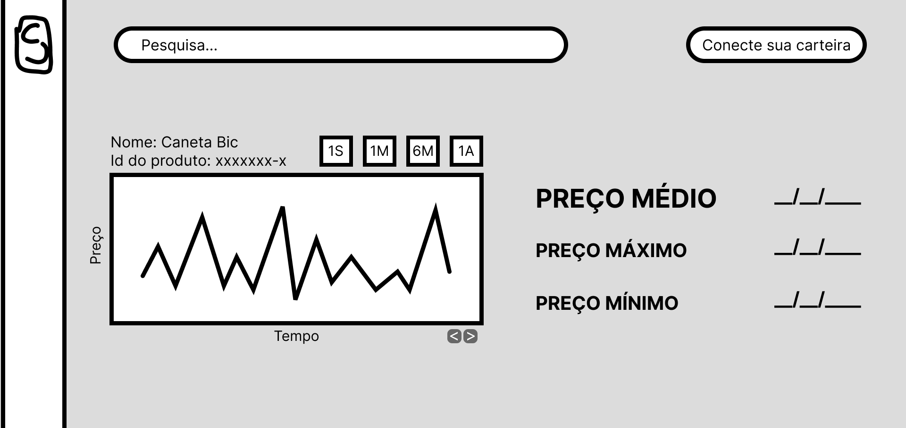

<h6 align="center"> Fonte: Elaborado pelos autores </h6>

### Mockup:

&emsp;No mockup da página inicial, consolidamos o estilo visual definido. Destacamos os elementos principais, como a barra de pesquisa e o botão "Conectar Carteira", garantindo uma experiência coesa e intuitiva para o usuário. Destacamos também as informações mais relevantes e tornamos a visualização do histórico de preços mais intuitiva e atraente.

<h6 align="center"> Imagem 25: Value Home Page Mockup </h6>

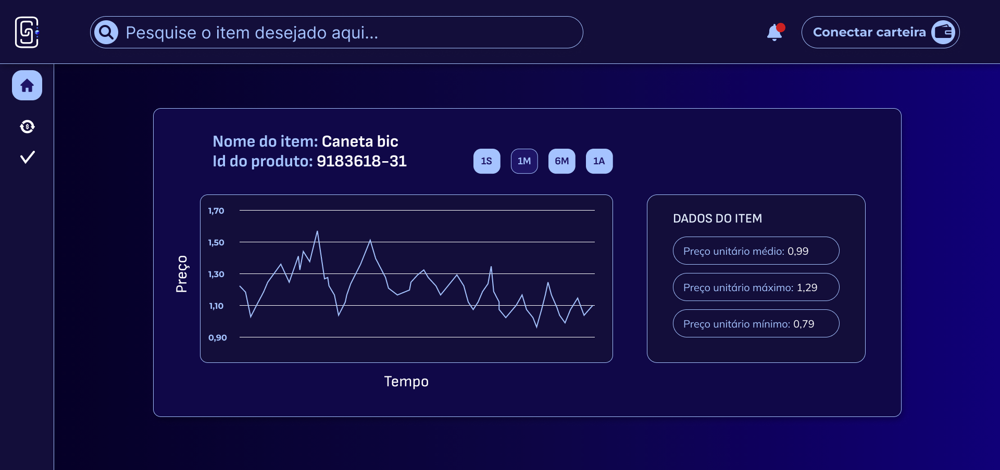
<h6 align="center"> Fonte: Elaborado pelos autores </h6>

### Design MVP:

&emsp;O design MVP desta página abrange uma variedade de funcionalidades essenciais, oferecendo uma solução abrangente para os usuários. Além de permitir a adição de usuários e a realização de transações, também oferece a capacidade de visualizar o histórico das transações realizadas. Com isso, os usuários podem facilmente gerenciar suas interações na plataforma, desde a inclusão de novos usuários até o acompanhamento das transações concluídas. Essa abordagem abrangente proporciona uma experiência completa aos usuários, atendendo às principais necessidades de gestão e acompanhamento dentro do contexto da plataforma de transações.

<h6 align="center"> Imagem 26: Tela inspecionar </h6>

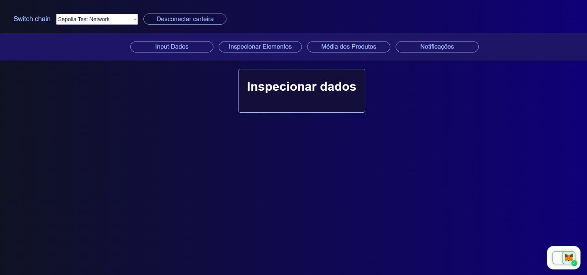 <p>

<h6 align="center"> Fonte: Elaborado pelos autores </h6>

<h6 align="center"> Imagem 27: Tela notificação de evento </h6>
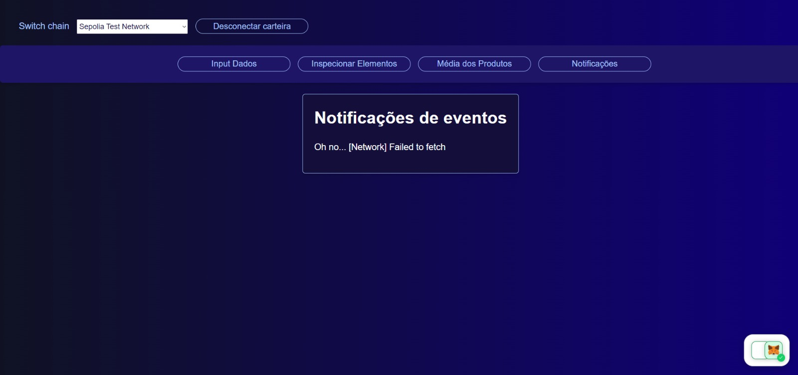 <p>

<h6 align="center"> Fonte: Elaborado pelos autores </h6>

<h6 align="center"> Imagem 28: Tela preço médio </h6>
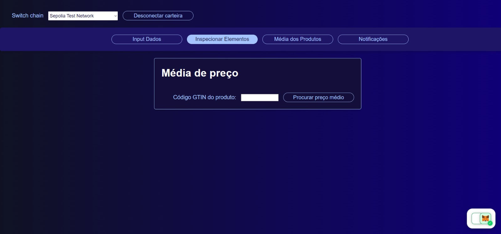 <p>

<h6 align="center"> Fonte: Elaborado pelos autores </h6>

<h6 align="center"> Imagem 29: Tela input de dados </h6>
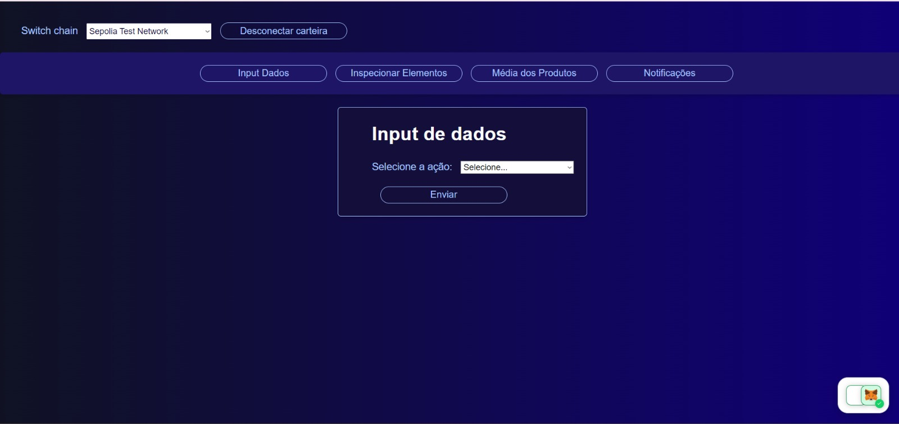 <p>

<h6 align="center"> Fonte: Elaborado pelos autores </h6>

### Relação com as Heurísticas de Nielsen:

- **Visibilidade do status do sistema:** Os elementos da página inicial fornecem feedback claro ao usuário sobre o estado do sistema, como a disponibilidade da barra de pesquisa e a indicação do botão "Conectar Carteira".
- **Prevenção de erros:** Os elementos de navegação e interação são claramente identificáveis e não propensos a erros devido ao seu design intuitivo e layout organizado.
- **Reconhecimento ao invés de memorização:** As informações são apresentadas de forma clara e organizada, permitindo que o usuário reconheça facilmente os detalhes do produto sem a necessidade de memorização.
- **Flexibilidade e eficiência de uso:** O layout dos detalhes do produto permite que os usuários encontrem facilmente as informações desejadas, proporcionando uma experiência eficiente.

### Tela 2: Popup MetaMask

### Wireframe:

&emsp;O wireframe do popup MetaMask enfoca na clareza da mensagem e na disposição dos botões de ação. Priorizamos a simplicidade e a usabilidade para garantir uma integração suave com a carteira MetaMask.

<h6 align="center"> Imagem 30: popUp Wireframe </h6>

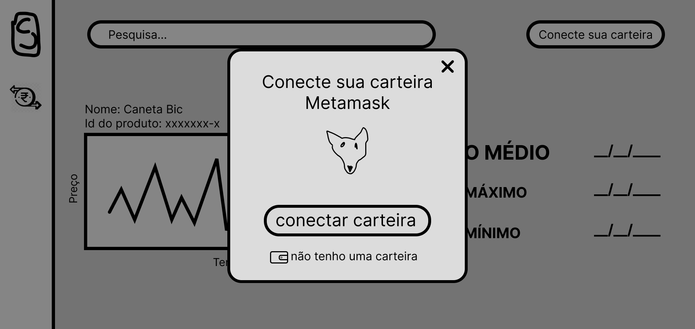

<h6 align="center"> Fonte: Elaborado pelos autores </h6>

### Mockup:

&emsp;No mockup do popup MetaMask, aplicamos um design limpo e destacamos a mensagem principal. Os botões de ação são claramente visíveis, facilitando a interação do usuário e garantindo uma experiência sem complicações.

<h6 align="center"> Imagem 31: popUp Mockup </h6>

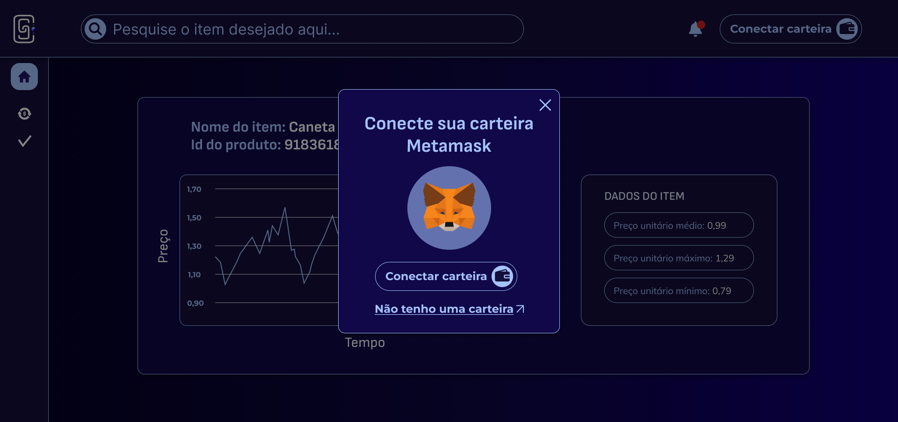

<h6 align="center"> Fonte: Elaborado pelos autores </h6>

### Design MVP

&emsp;No design MVP desta plataforma, o foco central está no botão "Conectar Carteira", representando a funcionalidade principal para os usuários iniciarem suas transações. Esta abordagem simplificada é fundamental para o MVP, concentrando-se em oferecer uma funcionalidade central de forma clara e acessível. Além disso, é apresentado é um pop-up no qual o usuário seleciona sua carteira Metamask e realiza o login.

<h6 align="center"> Imagem 32: homepage MVP </h6>

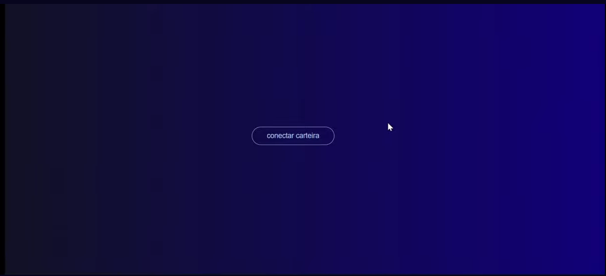

<h6 align="center"> Fonte: Elaborado pelos autores </h6>

<h6 align="center"> Imagem 33: Conexão Metamask  </h6>


<h6 align="center"> Fonte: Elaborado pelos autores </h6>

### Relação com as Heurísticas de Nielsen:

- **Estética e design minimalista:** O design limpo do popup MetaMask segue os princípios de uma interface minimalista, garantindo que a mensagem seja claramente comunicada ao usuário sem distrações desnecessárias.
- **Flexibilidade e eficiência de uso:** Os botões de ação são facilmente identificáveis e acessíveis, permitindo que os usuários interajam com o popup de forma rápida e eficiente.
- **Feedback do usuário:** Os usuários recebem feedback instantâneo sobre suas interações, seja ao clicar em um botão de ação ou ao receber uma confirmação de que sua ação foi concluída com sucesso.

### Tela 3: Explicação sobre a Metamask

### Wireframe:

&emsp;O wireframe de explicação sobre a Metamask concentra-se na explicação sobre o porquê e como obter uma carteira Metamask. Prioriza-se a clareza na apresentação das informações, destacando os benefícios e os passos necessários para adquirir e configurar essa ferramenta fundamental para interações seguras e eficientes na plataforma. O layout simples e intuitivo visa garantir que os usuários compreendam facilmente a importância da Metamask e sintam-se capacitados a iniciar o processo de obtenção desta carteira digital.

<h6 align="center"> Imagem 34: Explicação Metamask Wireframe </h6>

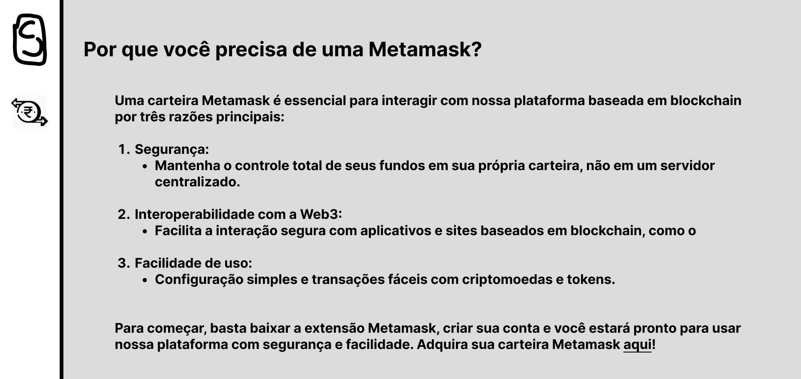

<h6 align="center"> Fonte: Elaborado pelos autores </h6>

### Mockup:

&emsp;No mockup de explicação sobre a Metamask, a ênfase recai sobre a apresentação visualmente atraente e informativa dos benefícios e do processo de obtenção da carteira Metamask. O design é cuidadosamente elaborado para garantir que as informações sejam apresentadas de forma clara e acessível, incentivando os usuários a adquirirem a carteira Metamask e aproveitarem ao máximo os recursos oferecidos pela plataforma.

<h6 align="center"> Imagem 35: Explicação Metamask Mockup</h6>

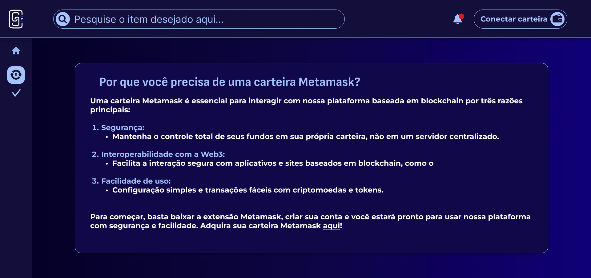

<h6 align="center"> Fonte: Elaborado pelos autores </h6>

### Relação com as Heurísticas de Nielsen:

- **Estética e design minimalista:** O mockup adota um design limpo e minimalista, garantindo que as informações sobre a Metamask sejam apresentadas de forma clara e concisa, sem distrações desnecessárias. Isso contribui para uma experiência visual agradável e facilita a compreensão dos usuários sobre o assunto.
- **Flexibilidade e eficiência de uso:** Os elementos do mockup são projetados para serem facilmente identificáveis e acessíveis, permitindo que os usuários interajam de forma rápida e eficiente com as informações apresentadas. Isso proporciona uma experiência de uso fluida e intuitiva, contribuindo para a eficácia do mockup na explicação sobre a Metamask.

### Tela 4: Registrar Transação

### Wireframe:

&emsp;O wireframe do registro de transação destaca a organização dos campos do formulário e a função do botão "Registrar Transação". Priorizamos a clareza e a facilidade de uso nesta etapa inicial do design.

<h6 align="center"> Imagem 36: Transação Wireframe </h6>

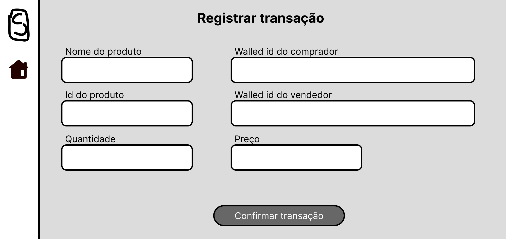

<h6 align="center"> Fonte: Elaborado pelos autores </h6>

### Mockup:

&emsp;No mockup do registro de transação, mantivemos a coerência com o estilo visual definido anteriormente. Os campos do formulário são claramente definidos, e o botão de ação é destacado para orientar o usuário durante o processo de registro.

<h6 align="center"> Imagem 37: Transação Mockup </h6>

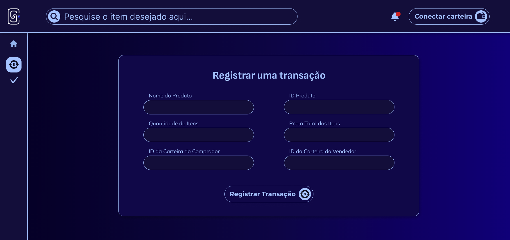

<h6 align="center"> Fonte: Elaborado pelos autores </h6>

### Relação com as Heurísticas de Nielsen:

- **Reconhecimento ao invés de memorização:** Os campos do formulário são claramente rotulados, permitindo que os usuários identifiquem facilmente as informações necessárias para registrar a transação.
- **Prevenção de erros:** O design claro e organizado do formulário reduz a probabilidade de erros durante o processo de registro, proporcionando uma experiência de usuário mais segura e confiável.

### Tela 5: Pop-up de Confirmação de Transação

### Wireframe:

&emsp;O wireframe da confirmação de transação enfoca na disposição da mensagem de sucesso e nas instruções seguintes. Priorizamos a clareza e a simplicidade para garantir uma experiência tranquila para o usuário.

<h6 align="center"> Imagem 38: popUp sucesso Wireframe </h6>

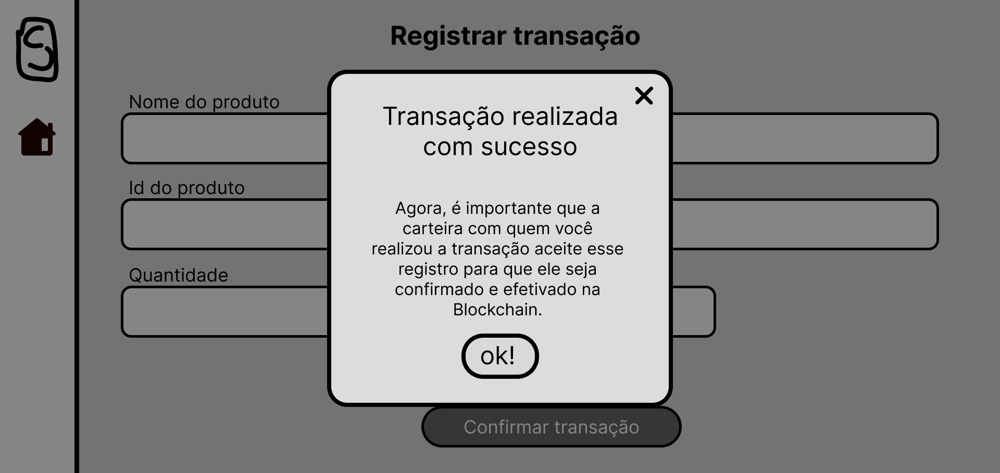

<h6 align="center"> Fonte: Elaborado pelos autores </h6>

### Mockup:

&emsp;No mockup da confirmação de transação, aplicamos o estilo visual consistente com o restante da plataforma. Destacamos a mensagem de sucesso e fornecemos instruções claras para os próximos passos, garantindo que o usuário se sinta confiante durante o processo.

<h6 align="center"> Imagem 39: popUp sucesso Mockup </h6>

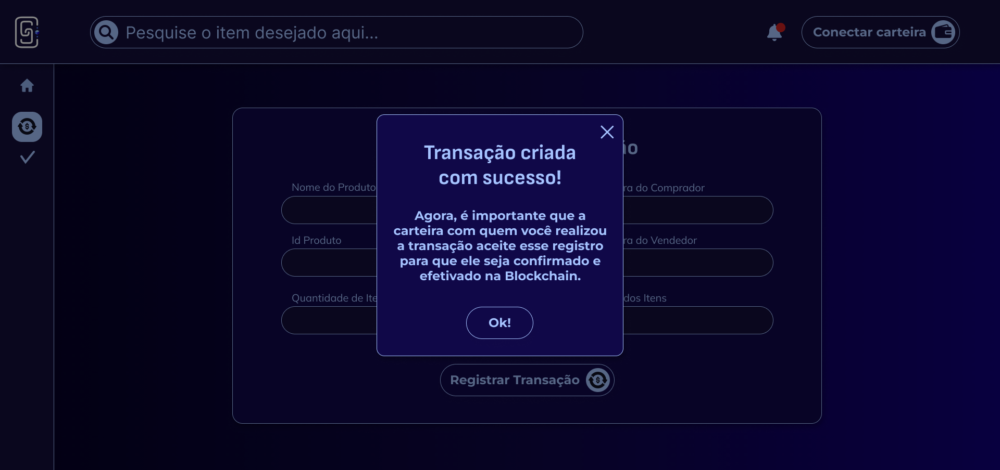

<h6 align="center"> Fonte: Elaborado pelos autores </h6>

### Relação com as Heurísticas de Nielsen:

- **Feedback ao usuário:** A mensagem de sucesso e as instruções fornecem feedback imediato ao usuário, garantindo que ele esteja ciente do status da transação e dos próximos passos a serem seguidos.
- **Flexibilidade e eficiência de uso:** As instruções claras e diretas permitem que os usuários concluam o processo de confirmação de transação de forma eficiente, sem a necessidade de esforço adicional.

### Tela 6: Solicitação de Transação

### Wireframe:

&emsp;O wireframe da tela de solicitação de transação enfoca na disposição clara dos detalhes da transação solicitada, como o nome do produto, valor e informações do destinatário. Priorizamos a organização e a legibilidade para garantir uma compreensão fácil por parte do usuário.

<h6 align="center"> Imagem 40: popUp confirmar transação Wireframe </h6>

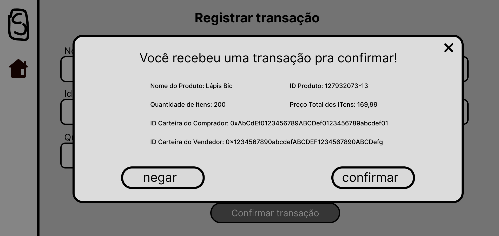

<h6 align="center"> Fonte: Elaborado pelos autores </h6>

### Mockup:

&emsp;No mockup da tela de solicitação de transação, aplicamos o estilo visual consistente com o restante da plataforma. Destacamos os detalhes da transação solicitada e fornecemos opções claras para que o usuário possa confirmar ou cancelar a transação, garantindo uma experiência intuitiva e sem complicações.

<h6 align="center"> Imagem 41: popUp confirmar transação Mockup </h6>

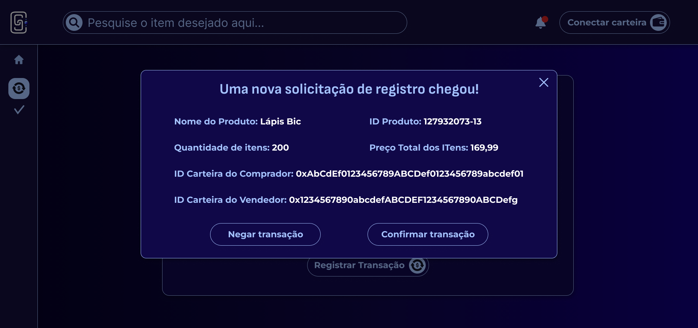

<h6 align="center"> Fonte: Elaborado pelos autores </h6>

### Relação com as Heurísticas de Nielsen:

- **Visibilidade do status do sistema:** Os detalhes da transação são apresentados de forma clara e acessível, permitindo que o usuário compreenda facilmente o contexto e o status da transação solicitada.
- **Prevenção de erros:** Opções claras para confirmar ou cancelar a transação são fornecidas, reduzindo a probabilidade de erros por parte do usuário e garantindo que ele tenha controle total sobre suas ações.
- **Feedback ao usuário:** A presença de opções claras e visíveis para confirmar ou cancelar a transação, bem como feedback imediato após a ação do usuário, garante que ele esteja ciente do status da transação e dos próximos passos a serem seguidos.
- **Flexibilidade e eficiência de uso:** O design da tela permite que o usuário conclua o processo de confirmação de transação de forma eficiente e sem esforço adicional, contribuindo para uma experiência de usuário satisfatória.

### 6.1.3 Considerações Técnicas

&emsp;A implementação será realizada utilizando HTML, React e CSS, visando garantir uma compatibilidade ampla entre navegadores e dispositivos. A responsividade e o tempo de carregamento rápido serão priorizados para garantir uma experiência de usuário otimizada.

**Conclusão**

&emsp;Esta documentação fornece uma visão detalhada do processo de design, desde a concepção inicial até a implementação final das telas do projeto. Além disso, abordamos a relação de cada tela com as heurísticas de Nielsen, garantindo que o design da interface atenda aos princípios de usabilidade e experiência do usuário.

&emsp;Ao considerar as heurísticas de Nielsen em cada etapa do processo de design, buscamos garantir que a plataforma ofereça uma experiência consistente, intuitiva e eficiente para os usuários. A visibilidade do status do sistema, a prevenção de erros e a flexibilidade de uso foram consideradas em cada tela, contribuindo para uma experiência de usuário mais satisfatória.

&emsp;Por fim, a implementação técnica será realizada com foco na compatibilidade e responsividade, visando garantir que a plataforma seja acessível em diferentes dispositivos e navegadores. Com uma abordagem centrada no usuário e no cumprimento das heurísticas de Nielsen, estamos confiantes de que o design do projeto proporcionará uma experiência positiva e eficaz para os usuários finais.

## 6.2 Videos

&emsp;Nessa seção mostraremos os vídeos de demonstração do nosso front-end, backend e integração da wallet. Nestes vídeos, oferecemos uma visão detalhada e interativa da interface de usuário que acompanha nossa solução e como utilizar o nosso site. No priemiro vídeo será possível explorar as funcionalidades da página e os recursos que tornam nossa plataforma acessível e eficiente para os usuários, entre eles as heurísticas de Nielsen, que serviram de base para o desenvolvimento desse front-end. No segundo video você entendera como fazer para inicar o site no seu computador e enender como  funciona o sistema de rollup do site e inicializar o backend.

#### Video de demonstração do frotend do site

[](https://www.youtube.com/watch?v=nseCTyQ6ue4)

&emsp;O vídeo é uma ferramenta importantíssima para demonstração do front-end, com ela é possível demonstrar como está o funcionamento da plataforma e também guiar o usuário em relação as funcionalidades presentes na plataforma. Dessa forma, o usuário consegue compreender o funcionamento do front-end e também navegar pela plataforma mais facilmente.

#### Video de demonstração deploy de smart contracts, integração da wallet com o site e testnets do site

[](https://www.youtube.com/watch?v=oZlkizeqEvc)

&emsp;O vídeo é uma ponte entre o usuário e a complexidade do nosso projeto, começando com a inicialização do site, passando pelo deploy do contrato, e até a inovação trazida pelos rollups. De forma direta, mas sem perder a seriedade, explicamos cada etapa crucial, facilitando o entendimento do funcionamento da plataforma. Esse resumo visual não só torna a navegação intuitiva, mas também destaca como os rollups otimizam o uso da blockchain, mostrando o valor real do nosso trabalho.

# 7. Documentação do Código
<a id="documentacao-do-codigo"></a>
## 7.1. Backend
&emsp;Essa sessão é dedicada para a documentação do código dos smart contracts e de suas funcionalidades. O objetivo é tornar o entendimento do código mais eficiente e efetivo para futuras melhorias, além de auxiliar no conserto de bugs e falhas. É importante acrescentar que essa sessão está suscetível a mudanças ao longo do projeto por conta de atualizações e melhoras do código original. O código se refere,às regras de negócio RN01, RN02 e RN03.<p>

```solidity
// SPDX-License-Identifier: MIT
pragma solidity 0.8.24;
// pragma solidity ^0.8.0;
// pragma solidity >=0.8.0 <0.9.0;

// seller: 0x999bf57501565dbd2fdcea36efa2b9aef8340a8901e3459f4a4c926275d36cdb
// buyer: 0x5931b4ed56ace4c46b68524cb5bcbf4195f1bbaacbe5228fbd090546c88dd229

contract ChainSync {
  // Mapeamento para verificar se um endereço é um usuário registrado
  mapping(address => bool) private users;

  // Endereço do proprietário do contrato
  address public owner;

  // Estrutura para representar uma transação
  struct Transaction {
    bytes32 seller;
    bytes32 buyer;
    uint256 productId;
    uint256 price;
    uint256 quantity;
    string timestamp;
  }

  // Lista de transações registradas
  Transaction[] private transactions;

  // Construtor do contrato, é executado ao fazer o deploy
  constructor(){
    owner = msg.sender;
  }

  // Função para registrar um novo usuário no contrato
  function registerUser(address _user) public {
    require(msg.sender == owner, "Apenas o proprietario pode registrar usuarios");
    users[_user] = true;
  }

  // Função para registrar uma nova transação
  function registerTransaction(bytes32 _seller, bytes32 _buyer, uint256 _productId, uint256 _price, uint256 _quantity, string memory _timestamp) external returns (bool) {
    require(users[msg.sender], "Somente usuarios podem registrar transacoes");
    Transaction memory transaction = Transaction({
        seller: _seller,
        buyer: _buyer,
        productId: _productId,
        price: _price,
        quantity: _quantity,
        timestamp: _timestamp
    });
    transactions.push(transaction);
    return true;
  }

  // Função para obter todas as transações registradas
  function getAllTransactions() external view returns (Transaction[] memory) {
    require(users[msg.sender], "Somente usuarios podem visualizar as transacoes");
    return transactions;
  }

  // Função para converter um endereço em sua representação hash
  function addressToHash(address _address) public pure returns (bytes32){
    return keccak256(abi.encodePacked(_address));
  }
}
```

&emsp;Com o objetivo esclarecer as funcionalidades presentes no código e destacar em quais partes cada regra de negócios está sendo aplicada, o código será detrinchado de maneira que facilite seu entendimento e aplixação.<p>

```solidity
// SPDX-License-Identifier: MIT
pragma solidity 0.8.24;
// pragma solidity ^0.8.0;
// pragma solidity >=0.8.0 <0.9.0;

// seller: 0x999bf57501565dbd2fdcea36efa2b9aef8340a8901e3459f4a4c926275d36cdb
// buyer: 0x5931b4ed56ace4c46b68524cb5bcbf4195f1bbaacbe5228fbd090546c88dd229
```

&emsp;Tem-se a declaração de qual versão está sendo utilizada em solidity. Além disso, os comentários "seller e buyer" tem destaque por serem os hashs utulizados para os testes necessários, com o intuito de visualizar o funcionamento das regras.<p>

```solidity
contract ChainSync {
  // Mapeamento para verificar se um endereço é um usuário registrado
  mapping(address => bool) private users;

  // Endereço do proprietário do contrato
  address public owner;
```

&emsp;Nesse momento, o código verifica se o endereço inserido é de um usuário cadastrado dentro da rede, e após isso, atribui o contrato ao endereço do proprietário<p>

```solidity
// Estrutura para representar uma transação
  struct Transaction {
    bytes32 seller;
    bytes32 buyer;
    uint256 productId;
    uint256 price;
    uint256 quantity;
    string timestamp;
  }
```

&emsp;Nesse trecho cria-se uma estrutura que contém todas as informações necessárias para criar uma transação. Como o vendedor, o comprador, o id do produto, o preço, a quantidade e o tempo de duração.<p>

```solidity
// Lista de transações registradas
  Transaction[] private transactions;

  // Construtor do contrato, é executado ao fazer o deploy
  constructor(){
    owner = msg.sender;
  }
```

&emsp;Neste trecho do código, se define uma lista de transações registradas como um array privado de objetos Transaction (do trecho anterior). Além disso, apresenta um construtor para o contrato, o qual é executado automaticamente ao realizar o deploy. No construtor, a variável owner é atribuída com o endereço do remetente da transação (msg.sender).<p>

```solidity
  // Função para registrar um novo usuário no contrato
  function registerUser(address _user) public {
    require(msg.sender == owner, "Apenas o proprietario pode registrar usuarios");
    users[_user] = true;
  }
```
&emsp;Neste trecho, se define uma função chamada registerUser que permite registrar um novo usuário no contrato. A função verifica se o remetente da transação é o proprietário do contrato usando a declaração require. Se o remetente não for o proprietário, a transação vai falhar com a mensagem de erro especificada. Caso contrário, o endereço do novo usuário é adicionado ao mapeamento users, marcando-o como verdadeiro, indicando que o usuário está registrado.<p>

```solidity
 // Função para registrar uma nova transação
  function registerTransaction(bytes32 _seller, bytes32 _buyer, uint256 _productId, uint256 _price, uint256 _quantity, string memory _timestamp) external returns (bool) {
    require(users[msg.sender], "Somente usuarios podem registrar transacoes");
    require(_seller != _buyer, "O comprador e o vendedor não podem ser a mesma pessoa");
    Transaction memory transaction = Transaction({
        seller: _seller,
        buyer: _buyer,
        productId: _productId,
        price: _price,
        quantity: _quantity,
        timestamp: _timestamp
    });
    transactions.push(transaction);
    return true;
  }
```

&emsp;Neste trecho, a função registerTransaction é definida para permitir o registro de uma nova transação no contrato. Primeiro, a função verifica se o remetente da transação é um usuário registrado, verificando se seu endereço está presente no mapeamento users. Se o remetente não for um usuário válido, a transação será rejeitada com a mensagem de erro especificada.Além disso, se o comprador e o vendedor tiverem o mesmo ID, a transação também será cancelada e enviará a devida mensagem de erro. Em seguida, uma nova transação é criada e inicializada com os parâmetros fornecidos: vendedor, comprador, ID do produto, preço, quantidade e carimbo de data/hora. Esta transação é então adicionada ao array transactions. Finalmente, a função retorna verdadeiro para indicar que a transação foi registrada com sucesso. <p>

```solidity
  // Função para obter todas as transações registradas
  function getAllTransactions() external view returns (Transaction[] memory) {
    require(users[msg.sender], "Somente usuarios podem visualizar as transacoes");
    return transactions;
  }
```

&emsp; Neste trecho, a função getAllTransactions é definida para permitir que os usuários obtenham todas as transações registradas no contrato. Primeiramente, a função verifica se o remetente da transação é um usuário válido, verificando se seu endereço está presente no mapeamento users. Se o remetente não for um usuário válido, a função retorna uma mensagem de erro especificada. Caso contrário, todas as transações registradas são retornadas por meio do array transactions.<p>

```solidity

  // Função para converter um endereço em sua representação hash
  function addressToHash(address _address) public pure returns (bytes32){
    return keccak256(abi.encodePacked(_address));
  }
```

&emsp;Neste trecho, a função addressToHash é definida para converter um endereço Ethereum em sua representação hash. A função utiliza a função keccak256 para calcular o hash do endereço fornecido como argumento. O argumento _address é codificado em bytes antes de ser passado para keccak256, garantindo uma representação consistente e única. A função retorna o hash resultante como um tipo bytes32.<p>

**Conclusão**

&emsp;Em suma, o contrato Solidity ChainSync oferece uma estrutura robusta para gerenciamento de transações e usuários na blockchain, permitindo o registro de transações e usuários, bem como a obtenção de transações registradas. Além disso, a função para converter endereços em suas representações hash acrescenta uma camada adicional de segurança e utilidade. No entanto, é importante notar que o código está sujeito a mudanças no futuro para implementações e correções, refletindo a natureza dinâmica e evolutiva do desenvolvimento de contratos inteligentes na blockchain.<p>

## 7.2 Testes Automatizados

> *Com o Smart Contract em Solidity*
> 

&emsp;Os testes automatizados são procedimentos pré-definidos que verificam automaticamente o comportamento do software. Eles auxiliam os desenvolvedores a identificar rapidamente problemas e regressões no código, resultando em um processo de desenvolvimento mais confiável e com menos bugs. Esses testes garantem que o software atenda aos requisitos e expectativas dos usuários.

&emsp;Os testes realizados foram baseados na primeira versão do código do contrato inteligente do grupo.

### 7.2.1. Casos de Teste

&emsp;Casos de teste são um conjunto de condições ou variáveis sob as quais um determinado comportamento, ou função de um sistema é testado para verificar se ele opera conforme o esperado. Em termos simples, um caso de teste descreve uma situação específica e os resultados esperados ao realizar uma determinada ação em um sistema.

<h6 align="center"> Tabela 7: Casos de Teste </h6>

<div align="center"></div>

| ID | Pré-condição | Descrição | Entrada | Resultado Esperado | Pós-condição |
| --- | --- | --- | --- | --- | --- |
| C-01 | Carteira do dono indicada no código e public users | Registro de um novo usuário pelo dono do contrato | Carteira fictícia de um novo usuário | Aceitar | Usuário devidamente registrado no sistema |
| C-02 | Carteira do dono indicada no código | Registro de um novo usuário por uma carteira qualquer | Carteira fictícia de um novo usuário e de um falso ‘owner’ | Rejeitado | Nenhum usuário inserido no sistema |
| C-03 | Mapeamento para verificar se o usuário que está inserindo os dados está no sistema | Registro de uma transação  | Dados fictícios de uma transação | Aceitar | Transação devidamente registrada no sistema |
| C-04 | Transações registradas no sistema | Retorno de todas as transações registradas | Nenhuma | Aceitar | Retorno de uma lista de transações realizadas  |
| C-05 | Uma carteira registrada | Transformação de uma carteira em hash | Carteira fictícia | Aceitar | Carteira original devidamente protegida e transformada em hash |

<h6 align="center"> Fonte: Sophia Nóbrega </h6>

<div align="center"></div>

&emsp;Em Solidity, os casos de teste são implementados usando frameworks de teste como os do Remix, que permitem escrever scripts de teste automatizados para verificar o comportamento dos contratos inteligentes.

### 7.2.2. Funções testadas

&emsp;Consideramos que cada método do contrato (cada função) é um caso de teste. Com isso, temos então quatro funções para apresentar como funções testadas, sendo uma delas testada duas vezes. São elas:

&emsp;`registerUser()` responsável por determinar como os usuários devem ser registrados e por quem, nesse caso deve ser o dono (owner) do contrato. Ela foi testada duas vezes, com a carteira do dono hardcoded (colocada no contrato) testamos dois casos: um onde o dono do contrato registra um usuário; e outro onde outra carteira tenta registrar um novo usuário.

&emsp;Abaixo temos o código dos testes:

```solidity
// Teste para o caso C-01: Registro de um novo usuário pelo dono do contrato
function testRegisterNewUserByOwner() public {
	address newUser = address(0x123); // Carteira fictícia de um novo usuário
  chainSync.registerUser(newUser);
  Assert.equal(chainSync.users(newUser), true, "Falha ao registrar novo usuario pelo proprietario");
}

// Teste para o caso C-02: Registro de um novo usuário por uma carteira qualquer
function testRegisterNewUserByNonOwner() public {
	address newUser = address(0x456); // Carteira fictícia de um novo usuário
  address fakeOwner = address(0x789); // Carteira fictícia de um falso 'owner'
  chainSync.registerUser(fakeOwner);
  // O teste só deve passar se o registro for rejeitado
  Assert.equal(chainSync.users(newUser), false, "Usuario registrado por nao proprietario");
}
```

&emsp;Além da função mencionada, também testamos a `registerTransaction()`, responsável por registrar as transações realizadas no contrato. O teste foi feito para verificar se o sistema recebe corretamente as informações e as registra com sucesso.

&emsp;A seguir, o código do teste:

```solidity
// Caso C-03: Registro de uma transação
function testRegisterTransaction() public {
  bytes32 seller = "seller"; // Dados fictícios de uma transação
  bytes32 buyer = "buyer";
  uint256 productId = 123;
  uint256 price = 100;
  uint256 quantity = 1;
  string memory timestamp = "2024-03-31";
        
  bool success = chainSync.registerTransaction(seller, buyer, productId, price, quantity, timestamp);
  Assert.equal(success, true, "Falha ao registrar transacao");
}
```

&emsp;A função `getAllTransactions()`, responsável por chamar todas as transações registradas no sistema, também foi testada.

&emsp;A seguir, o código do teste:

```solidity
// Caso C-04: Retorno de todas as transações registradas
function testGetAllTransactions() public {
    // Registra algumas transações fictícias para teste
    chainSync.registerTransaction("seller1", "buyer1", 1, 100, 1, "2024-03-31");
    chainSync.registerTransaction("seller2", "buyer2", 2, 200, 2, "2024-04-01");
        
    // Obtém todas as transações registradas
    ChainSync.Transaction[] memory transactions = chainSync.getAllTransactions();
        
    // Verifica se o número de transações retornadas é igual ao esperado
    Assert.equal(transactions.length, 2, "Numero incorreto de transacoes retornadas");
}
```

&emsp;Finalmente, testamos a função responsável por criar hashes a partir da carteira do usuário registrado, a `addressToHash()`.

&emsp;Aqui está o código de teste:

```solidity
	// Caso C-05: Transformação de uma carteira em hash
	function testAddressToHash() public {
		address wallet = address(0xabc); // Carteira fictícia
	  bytes32 walletHash = chainSync.addressToHash(wallet);
  // A verificação de igualdade direta de hashes não é possível, então verificamos apenas se não é um hash vazio
	  Assert.notEqual(walletHash, bytes32(0), "Falha na conversao de endereco para hash");
	}
```

### 7.2.3. Etapas de Teste

> *Obtenha o passo a passo para a realização dos testes.*
> 

&emsp;A fim de permitir uma fácil replicação dos testes e um melhor entendimento deles, segue abaixo o passo a passo para sua realização: </p>

**01. Compreensão da Importância dos Testes em Smart Contracts:**

&emsp;É crucial compreender a importância dos testes em smart contracts, visto que eles são essenciais para garantir a funcionalidade e segurança do sistema. </p>

**02. Desenvolvimento do Código do Smart Contract:**

&emsp;O próximo passo é desenvolver o código do smart contract em Solidity, contendo as funções que serão testadas. </p>

**03. Utilização da Remix IDE:**

&emsp;A Remix IDE é uma ferramenta poderosa para desenvolver e testar smart contracts. Ela oferece um ambiente amigável e funcionalidades específicas para contratos inteligentes. </p>

**04. Criação de Casos de Teste:**

&emsp;Desenvolva casos de teste que abranjam diferentes cenários e possíveis fluxos de execução das funções do contrato. </p>

**05. Implementação do Código de Testes:**

&emsp;Para criar casos de teste eficazes para as funções do contrato, você pode seguir estas etapas: </p>

1. **Criação de Arquivos de Teste:**
&emsp;Comece criando arquivos de teste com extensão `_test.sol`. Estes arquivos conterão os casos de teste para as funções do seu contrato. </p>
2. **Importação da Biblioteca `remix_test.sol`:**
&emsp;Importe a biblioteca `remix_test.sol` no início do seu arquivo de teste. Essa biblioteca oferece uma variedade de métodos úteis para facilitar a escrita e execução dos testes. </p>
3. **Utilização dos Métodos da Biblioteca:**
&emsp;A biblioteca `remix_test.sol` disponibiliza métodos como `Assert.equal`, `Assert.notEqual`, `Assert.isTrue`, entre outros, que permitem realizar asserções e verificar o comportamento das funções do contrato. Por exemplo: </p>
    
    ```solidity
    import "remix_test.sol";
    
    contract ContratoTeste {
        // Importe o contrato a ser testado
        Contrato contrato;
    
        // Inicialize o contrato a ser testado
        function beforeAll() public {
            contrato = new Contrato();
        }
    
        // Teste para verificar se a função faz algo esperado
        function testAlgoEsperado() public {
            uint256 resultado = contrato.funcaoParaTestar();
            Assert.equal(resultado, valorEsperado, "O resultado não é o esperado");
        }
    
        // Outros casos de teste...
    }
    ```
    
4. **Escrita dos Casos de Teste:**
&emsp;Escreva os casos de teste para cada função do contrato, garantindo que eles cubram diferentes cenários e comportamentos esperados. Certifique-se de incluir testes para casos de sucesso e para casos de falha, se aplicável. </p>

&emsp;Ao seguir estas etapas e utilizar os métodos fornecidos pela biblioteca `remix_test.sol`, você poderá criar casos de teste abrangentes e robustos para as funções do seu contrato, ajudando a garantir a sua correta implementação e funcionamento. </p>

**06. Execução dos Testes no Solidity Unit Testing:**

&emsp;Utilize o ambiente de testes do Solidity Unit Testing, disponível no lado esquerdo da tela do Remix IDE, para rodar os arquivos de teste. Esse ambiente fornecerá feedback sobre os testes, indicando acertos e falhas. </p>

&emsp;Em resumo, o processo envolve compreender a importância dos testes, desenvolver o código do contrato, criar casos de teste, implementar os testes usando a biblioteca **`remix_test.sol`** e executá-los no Solidity Unit Testing para garantir a integridade e funcionalidade do smart contract. </p>

### 7.2.4. Resultados Obtidos

&emsp;Após a realização dos testes, queremos saber os resultados obtidos a partir deles. Para isso, abaixo separamos uma tabela mais direta com os resultados e logo em seguida uma descrição detalhada de cada um deles.

<h6 align="center"> Tabela 8: Resultados </h6>

<div align="center">

| ID | Resultado |
| --- | --- |
| C-01 | Aceito |
| C-02 | Rejeitado |
| C-03 | Aceito |
| C-04 | Aceito |
| C-05 | Aceito |

</div>

<h6 align="center"> Fonte: Sophia Nóbrega </h6>

<div align="center"></div>

#### 7.2.4.1. Descrição Detalhada

&emsp;Com o objetivo de melhor entendimento dos resultados obtidos, separamos esse tópico contendo imagens dos resultados e suas descrições. Segue o documento:

**C-01: Registro de um novo usuário pelo dono do contrato**

&emsp;Este teste verifica se um novo usuário pode ser registrado com sucesso por meio do proprietário do contrato. O teste cria uma carteira fictícia para o novo usuário, registra essa carteira usando a função **`registerUser`** do contrato **`chainSync`**, e então verifica se o usuário foi corretamente registrado ao verificar se a função **`users`** retorna verdadeiro para a carteira fornecida. Se o registro for bem-sucedido, o teste passa; caso contrário, uma mensagem de falha é exibida. </p>

<h6 align="center"> Imagem 42 </h6
				   
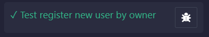

<h6 align="center"> Fonte: Sophia Nóbrega </h6>

<div align="center"></div>

&emsp;A função passou no teste.

**C-02: Registro de um novo usuário por uma carteira qualquer**

&emsp;Este teste verifica se o contrato impede o registro de um novo usuário por uma carteira que não é do proprietário. Ele cria uma carteira fictícia para o novo usuário e outra para um falso proprietário. Em seguida, tenta registrar o falso proprietário como um novo usuário e verifica se o novo usuário não foi registrado corretamente, garantindo que a função **`registerUser`** esteja funcionando corretamente para restringir o registro a apenas o proprietário legítimo. 

<h6 align="center"> Imagem 43 </h6>

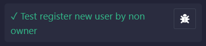

<h6 align="center"> Fonte: Sophia Nóbrega </h6>

<div align="center"></div>

&emsp;O usuário fictício não foi registrado, portanto a função passou com sucesso. </p>

**C-03: Registro de uma transação** 

&emsp;O teste dependia da aceitação pelo sistema das informações fornecidas. Para isso, usamos dados fictícios durante o teste. O resultado desta operação é armazenado na variável **`success`**, que será **`true`** se o registro da transação for bem-sucedido e **`false`** caso contrário.

<h6 align="center"> Imagem 44 </h6>

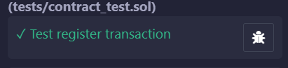

<h6 align="center"> Fonte: Sophia Nóbrega </h6>

<div align="center"></div>

&emsp;No caso, a função em questão passou o teste. </p>

**C-04: Retorno de todas as transações registradas**

&emsp;Este teste verifica se a funcionalidade de retorno de todas as transações registradas no sistema. Para garantir a validade do teste, foram inseridas transações fictícias no sistema. O resultado da operação é capturado na variável **`transactions`**, que armazena todas as transações retornadas pelo contrato. Se o número de transações retornadas corresponder ao esperado, a validação será bem-sucedida. Caso contrário, a validação indicará uma falha no processo.

<h6 align="center"> Imagem 45 </h6>

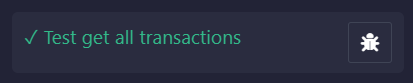

<h6 align="center"> Fonte: Sophia Nóbrega </h6>

<div align="center"></div>

&emsp;A função em questão também passou no teste. </p>

**C-05: Transformação de uma carteira em hash**

&emsp;Este teste verifica se a funcionalidade de transformação de um endereço de carteira em um hash. Utilizando uma carteira fictícia, a função **`addressToHash`** do contrato **`chainSync`** é invocada para executar a transformação. O resultado é armazenado na variável **`walletHash`**. A validação do teste consiste em garantir que o hash resultante não seja vazio.

<h6 align="center"> Imagem 46 </h6>

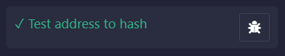

<h6 align="center"> Fonte: Sophia Nóbrega </h6>

<div align="center"></div>

&emsp;Ele também passou no teste. </p>

**Conclusão**

&emsp;Os testes automatizados realizados no contrato inteligente em Solidity confirmam sua funcionalidade e integridade. Os resultados indicam que o registro de novos usuários é adequadamente controlado, permitindo apenas o registro pelo proprietário do contrato. Além disso, a função de registro de transações opera corretamente, registrando transações com sucesso, e o retorno de todas as transações registradas é verificado de forma eficaz. A transformação de endereços de carteira em hash ocorre conforme esperado, fornecendo hashes não vazios. Esses testes sistemáticos validam o funcionamento do contrato, contribuindo para um processo de desenvolvimento mais confiável e resultando em um sistema mais robusto e confiável para os usuários.


# 8. Análise de Custos
<a id="analise-de-custos"></a>

A análise de custos é crucial em projetos, oferecendo uma visão detalhada dos recursos financeiros necessários e permitindo um planejamento eficiente da alocação de recursos. Ao prever e controlar os custos, os gerentes de projeto podem tomar decisões informadas, evitar desperdícios e garantir que o projeto permaneça dentro do orçamento. Isso não apenas aumenta a eficiência financeira, mas também ajuda a avaliar a viabilidade do projeto e maximizar seu valor a longo prazo, garantindo um retorno sobre o investimento positivo.

## 8.1. Custo de Produção

Para calcular o custo de produção, consideramos todos os recursos necessários durante a execução do projeto. É importante destacar que a Alliance não será cobrada, apesar de termos o custo total de produção registrado. Os itens incluídos abrangem desde mão de obra até equipamentos como computadores.

<h6 align="center"> Tabela 9: Custo de Produção </h6>

| Item | Quantidade | Unidade de Medida | Horas p/ un | Preço un | Preço Total |
| --- | --- | --- | --- | --- | --- |
| Mão de Obra | 7 | pessoas | 80 | 2.552 BRL | 17.864 BRL |
| Computadores | 7 | computadores | - | 3.500 BRL | 24.500 BRL |
| Banco de dados | 1 | banco de dados | - | 0 | 0 |
| IDE | 1 | IDE | - | 0 | 0 |
| Gas Teste | infinito | Gas | - | 0  | 0 |
| - | - | - | - | - | 42.364 BRL |

<h6 align="center"> Fonte: Sophia Nóbrega </h6>

O custo total foi calculado levando em conta todas as etapas do projeto, desde a documentação até o desenvolvimento de UX e código. Estimamos 80 horas de trabalho com base em uma semana de trabalho de 4 dias, com 2 horas diárias, considerando o custo por hora de um desenvolvedor pleno, que é de 31,9 reais.

## 8.2. Custos de Implementação

No contexto da implementação do projeto e sua integração com outros sistemas, é importante considerar que o custo estaria principalmente associado à hospedagem em nuvem para o armazenamento dos dados adquiridos. Com isso em mente, apresentamos a seguir uma tabela com diversas opções disponíveis no mercado, as quais podem representar oportunidades interessantes para o cliente:

<h6 align="center"> Tabela 10: Custos de Implemenação </h6>

| Serviço | Opção 1 | Opção 2 | Opção 3 | Diferencial |
| --- | --- | --- | --- | --- |
| Amazon Web Services (AWS) | 50TB p/ mês - 0.023 USD por GB | 450 TB p/ mês - 0.022 USD por GB | +500 TB p/ mês - 0.021 USD por GB | Ele é amplamente utilizado por empresas de todos os tamanhos devido à sua confiabilidade, escalabilidade e variedade de serviços. |
| Microsoft Azure | RA-GRS - 0.075 USD por GB | GZRS - 0.1012 USD por GB | RA-GZRS - 0.1265 USD por GB | Azure é popular entre as empresas que já utilizam outras soluções da Microsoft, como o Windows Server e o Office 365. |
| Google Cloud Plataform (GCP) | 0.255 USD por GB/mês para capacidade de armazenamento SSD | 0.135 USD por GB/mês para capacidade de armazenamento HD | 0.12 USD GB/mês para backups | É uma escolha popular para empresas que buscam soluções avançadas de tecnologia em nuvem. |

<h6 align="center"> Fonte: Sophia Nóbrega </h6>

Dado que a precificação desses serviços é altamente volátil, talvez não seja viável calcular os custos neste momento. Por isso, sugerimos que a Alliance utilize esta tabela como uma referência para avaliar qual opção melhor atende às necessidades da empresa.

## 8.3. Smart Contract

Com base na suposição de que um Smart Contract (SM) suporta 20 clientes simultâneos sem a necessidade de implantações extras, e considerando que a plataforma receberá 10% (cerca de 98 empresas - dados com base no próprio site da Alliance) dos clientes da Alliance ao longo de um período de 3 meses, com 2,5% deles chegando no primeiro mês e uma alavancagem de 100% ao mês, chegamos à seguinte necessidade mensal de implantações:

<h6 align="center"> Tabela 11: Custo do Smart Contract </h6>

| Mês | QuantidadeC | QuantidadeSM | Custo p/SM | Custo total |
| --- | --- | --- | --- | --- |
| Primeiro  | 24/25 | 2 | 0.000000019 BRL | 0,000000038 BRL |
| Segundo | 48/50 | 1 | 0.000000019 BRL | 0.000000019 BRL |
| Terceiro | 96/100 | 2 | 0.000000019 BRL | 0,000000038 BRL |
| - | - | - | - | 0,000000095 BRL |

<h6 align="center"> Fonte: Sophia Nóbrega </h6>

## 8.4. Registros de transação

Uma vez que os clientes (C) estão estabelecidos em seus contratos, o custo é principalmente associado à função de registro de transações executada a cada novo cadastro na plataforma. Estimamos que o custo dessa execução esteja em torno de 0.0000000011 BRL. Seguindo a mesma lógica de adesão à plataforma mencionada anteriormente e considerando que cada empresa cadastraria 60 tipos de itens mensalmente, obtemos o seguinte custo total:

<h6 align="center"> Tabela 12: Custos por transação </h6>

| Mês | QuantidadeC | Quantidade Total | Custo p/ un | Custo total |
| --- | --- | --- | --- | --- |
| Primeiro | 24 - 25 | 1440 - 1500 | 0,0000000011 BRL | 0,000001584 - 0,00000165 BRL |
| Segundo | 48 - 50 | 2.880 - 3.000 | 0,0000000011 BRL | 0,000003168 - 0,0000033 BRL |
| Terceiro | 96 - 100 | 5.760 - 6.000 | 0,0000000011 BRL | 0,000006336 - 0,0000066 BRL |
| - | - | - | - | 0,000011088 - 0,00001155 BRL |

<h6 align="center"> Fonte: Sophia Nóbrega </h6>

**Conclusão**

Levando em conta todos os custos levantados anteriormente, podemos estimar que o custo total do projeto gira em torno de R$42.364,00. No entanto, é importante ressaltar que esse valor pode variar conforme a implementação avança e a demanda pelo serviço aumenta.

# 9. Referências bibliográficas
<a id="referencias-bibliograficas"></a>

1. https://gaea.com.br/arquitetura-de-solucoes/#:~:text=A%20arquitetura%20de%20soluções%20ajuda,custos%20de%20software%20e%20suporte.
2. https://www.estrategiaconcursos.com.br/blog/principios-seguranca-informacao/
3. https://tecnoblog.net/especiais/facebook-cambridge-analytica-dados/
4. https://www.investopedia.com/terms/b/blockchain.asp
5. https://online.hbs.edu/blog/post/what-is-data-integrity
6. https://www.linkedin.com/advice/0/how-can-you-ensure-data-integrity-blockchain
7. https://www.wallarm.com/what/what-is-blockchain-security-full-guide
8. https://unico.io/unicocheck/5-pilares-seguranca-informacao/
9. https://blog.bughunt.com.br/principios-da-seguranca-da-informacao/
10. https://pt.linkedin.com/pulse/importância-da-autenticação-de-usuário-na-segurança-naur-arjonas
11. https://unico.io/institucional/autenticacao-digital/
12. https://www.sgs.com/pt-pt/noticias/2021/11/integridade-dos-dados-e-a-sua-importancia
13. https://ictq.com.br/opiniao/1211-integridade-de-dados-levada-a-serio?rdst_srcid=2032905&fbclid=IwAR223lU-jXMG8b7n1uyHpoX5wuVCYcvuHtfFOXF8v3Emr9YQlE1Szn0BAYQ
14. https://akeloo.com.br/glossario-cripto/ataque-51/
15. https://academy.bit2me.com/pt/que-es-un-ataque-replay/
16. https://www.kaspersky.com.br/blog/five-threats-hardware-crypto-wallets/21239/
17. Amazon Web Services. AWS S3 - Precificação. Disponível em: [https://aws.amazon.com/pt/s3/pricing/](https://aws.amazon.com/pt/s3/pricing/). Acesso em: [16/03/2024].
18. Microsoft Azure. Microsoft Azure - Oferta Gratuita. Disponível em: [https://azure.microsoft.com/pt-br/free/search/?ef_id=_k_Cj0KCQjwhtWvBhD9ARIsAOP0GojuFiyPo2oOALPBDDtZkdSE6wYbipdRBifZnnPAfA-K9ut5B2GapDwaArQKEALw_wcB_k_&OCID=AIDcmmzmnb0182_SEM__k_Cj0KCQjwhtWvBhD9ARIsAOP0GojuFiyPo2oOALPBDDtZkdSE6wYbipdRBifZnnPAfA-K9ut5B2GapDwaArQKEALw_wcB_k_&gad_source=1&gclid=Cj0KCQjwhtWvBhD9ARIsAOP0GojuFiyPo2oOALPBDDtZkdSE6wYbipdRBifZnnPAfA-K9ut5B2GapDwaArQKEALw_wcB](https://azure.microsoft.com/pt-br/free/search/?ef_id=_k_Cj0KCQjwhtWvBhD9ARIsAOP0GojuFiyPo2oOALPBDDtZkdSE6wYbipdRBifZnnPAfA-K9ut5B2GapDwaArQKEALw_wcB_k_&OCID=AIDcmmzmnb0182_SEM__k_Cj0KCQjwhtWvBhD9ARIsAOP0GojuFiyPo2oOALPBDDtZkdSE6wYbipdRBifZnnPAfA-K9ut5B2GapDwaArQKEALw_wcB_k_&gad_source=1&gclid=Cj0KCQjwhtWvBhD9ARIsAOP0GojuFiyPo2oOALPBDDtZkdSE6wYbipdRBifZnnPAfA-K9ut5B2GapDwaArQKEALw_wcB). Acesso em: [16/03/2024].
19. Remix Ethereum. Disponível em: [https://remix.ethereum.org/](https://remix.ethereum.org/). Acesso em: [16/03/2024].
20. Google Cloud. Google Cloud SQL - Precificação. Disponível em: [https://cloud.google.com/sql/pricing?_gl=1*k7018g*_up*MQ..&gclid=Cj0KCQjwhtWvBhD9ARIsAOP0GojI-oUC4H-OjP2Rbrls-kgqtSEJdkbj7kzIwLB-e48Fe2Ob-1XqaLQaArHUEALw_wcB&gclsrc=aw.ds&hl=pt-br](https://cloud.google.com/sql/pricing?_gl=1*k7018g*_up*MQ..&gclid=Cj0KCQjwhtWvBhD9ARIsAOP0GojI-oUC4H-OjP2Rbrls-kgqtSEJdkbj7kzIwLB-e48Fe2Ob-1XqaLQaArHUEALw_wcB&gclsrc=aw.ds&hl=pt-br). Acesso em: [16/03/2024].
21. Alliance Consultoria. Disponível em:: [https://www.allianceconsultoria.com.br/](https://www.allianceconsultoria.com.br/). Acesso em: [16/03/2024]
