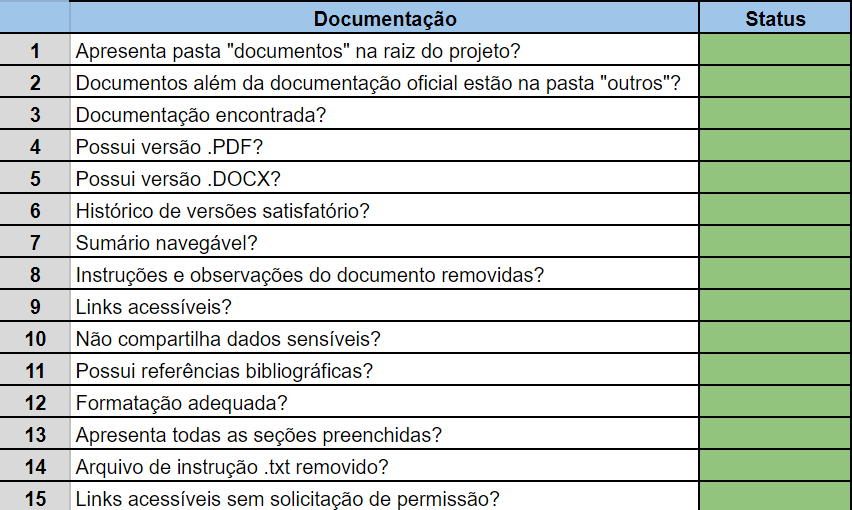

&emsp;Esse documento tem a função de facilitar e indicar onde está cada critério do escritório de projetos. Segue abaixo as imagens da tabela junto do link para cada seção ou trecho que está sendo solicitado.

# Readme

<h6 align="center"> Imagem 1: Read.me do projeto </h6>

	

<h6 align="center"> Fonte: Elaborado pelos autores </h6>

&emsp;<a href="https://github.com/Inteli-College/2024-T0010-SI05-G04?tab=readme-ov-file#chain-sync">1- Nome do projeto</a>

&emsp;<a href="https://github.com/Inteli-College/2024-T0010-SI05-G04?tab=readme-ov-file#chain-sync">2- Nome do grupo</a>

&emsp;<a href="https://github.com/Inteli-College/2024-T0010-SI05-G04?tab=readme-ov-file#-integrantes">3- Integrantes descritos</a>

&emsp;<a href="https://github.com/Inteli-College/2024-T0010-SI05-G04?tab=readme-ov-file#-integrantes">4- Links presentes e correto dos integrantes</a>

&emsp;<a href="https://github.com/Inteli-College/2024-T0010-SI05-G04?tab=readme-ov-file#-descrição">5- Descrição curta do projeto</a>

&emsp;<a href="https://github.com/Inteli-College/2024-T0010-SI05-G04?tab=readme-ov-file#-estrutura-de-pastas">6- Estrutura de pastas conforme o modelo</a>

&emsp;<a href="https://github.com/Inteli-College/2024-T0010-SI05-G04?tab=readme-ov-file#-hist%C3%B3rico-de-lan%C3%A7amentos">7- histórico de lançamentos</a>

&emsp;<a href="https://github.com/Inteli-College/2024-T0010-SI05-G04?tab=readme-ov-file#-hist%C3%B3rico-de-lan%C3%A7amentos">8- Histórico de lançamentos adequado</a>

&emsp;<a href="https://github.com/Inteli-College/2024-T0010-SI05-G04?tab=readme-ov-file#-licen%C3%A7alicense">9- Licença</a>

&emsp;<a href="https://github.com/Inteli-College/2024-T0010-SI05-G04?tab=readme-ov-file#-licen%C3%A7alicense">10- Inteli na licença</a>

&emsp;<a href="https://github.com/Inteli-College/2024-T0010-SI05-G04?tab=readme-ov-file#-licen%C3%A7alicense">11- nome do grupo na licença</a>

&emsp;<a href="https://github.com/Inteli-College/2024-T0010-SI05-G04?tab=readme-ov-file#-licen%C3%A7alicense">12- link dos integrantes na Referências</a>

&emsp;<a href="https://github.com/Inteli-College/2024-T0010-SI05-G04?tab=readme-ov-file#-licen%C3%A7alicense">13- Referências</a>

&emsp;<a href="https://github.com/Inteli-College/2024-T0010-SI05-G04?tab=readme-ov-file#inteli---instituto-de-tecnologia-e-lideran%C3%A7a">14- Imagem da logo do Inteli</a>

&emsp;<a href="https://github.com/Inteli-College/2024-T0010-SI05-G04">15- Instrições removidas</a>

# Documentação

<h6 align="center"> Imagem 2: Documentação do projeto </h6>

	

<h6 align="center"> Fonte: Elaborado pelos autores </h6>

&emsp;<a href="https://github.com/Inteli-College/2024-T0010-SI05-G04">1- documentos na raiz do projeto</a>

&emsp;<a href="https://github.com/Inteli-College/2024-T0010-SI05-G04/tree/main/docs">2- documentos além da oficial estão em outros</a>

&emsp;<a href="https://github.com/Inteli-College/2024-T0010-SI05-G04/tree/main/docs/documentacao.md">3- documentação encontrada</a>

&emsp;<a href="https://github.com/Inteli-College/2024-T0010-SI05-G04/tree/main/docs">4- documentação em PDF</a>

&emsp;<a href="https://github.com/Inteli-College/2024-T0010-SI05-G04/tree/main/docs">5- documentação em DOCX</a>

&emsp;<a href="https://github.com/Inteli-College/2024-T0010-SI05-G04/blob/main/docs/documentacao.md#historico-de-revis%C3%B5es">6- Histórico de versões</a>

&emsp;<a href="https://github.com/Inteli-College/2024-T0010-SI05-G04/blob/main/docs/documentacao.md#artefatos">7- Sumário navegável</a>

&emsp;<a href="https://github.com/Inteli-College/2024-T0010-SI05-G04/blob/main/docs/documentacao.md">8- Instruções removidas</a>

&emsp;<a href="https://github.com/Inteli-College/2024-T0010-SI05-G04/blob/main/docs/documentacao.md#9-refer%C3%AAncias-bibliogr%C3%A1ficas">9- Links acessíveis</a>

&emsp;<a href="https://github.com/Inteli-College/2024-T0010-SI05-G04/blob/main/docs/documentacao.md">10- Não compartilha dados sensíveis</a>

&emsp;<a href="https://github.com/Inteli-College/2024-T0010-SI05-G04/blob/main/docs/documentacao.md#9-refer%C3%AAncias-bibliogr%C3%A1ficas">11- Referências bibliográficas</a>

&emsp;<a href="https://github.com/Inteli-College/2024-T0010-SI05-G04/blob/main/docs/documentacao.md">12- Formatação adequada</a>

&emsp;<a href="https://github.com/Inteli-College/2024-T0010-SI05-G04/blob/main/docs/documentacao.md">13- Todas as seções preenchidas</a>

&emsp;<a href="https://github.com/Inteli-College/2024-T0010-SI05-G04/blob/main/docs/documentacao.md">14- Instrução .txt removido</a>

&emsp;<a href="https://github.com/Inteli-College/2024-T0010-SI05-G04/blob/main/docs/documentacao.md#9-refer%C3%AAncias-bibliogr%C3%A1ficas">15- Links acessíveis</a>

# Contrato

&emsp;Levando em consideração que foi utilizado a ferramenta Cartesi como base na solução proposta pelo grupo, as etapas de deploy e outros processos presentes em uma solução de smart contract utilizando solidity. Nos links que serão disponibilizados estarão presentes trechos da documentação que explicam os processos da Cartesi que equivalem aos solicitados.

<h6 align="center"> Imagem 3: Contrato</h6>

	

<h6 align="center"> Fonte: Elaborado pelos autores </h6>

&emsp;<a href="https://github.com/Inteli-College/2024-T0010-SI05-G04/blob/main/docs/documentacao.md#34-cartesi">1- Pasta de deploy</a>

&emsp;<a href="https://github.com/Inteli-College/2024-T0010-SI05-G04/blob/main/docs/documentacao.md#34-cartesi">2- Pasta de diagramas</a>

&emsp;<a href="https://github.com/Inteli-College/2024-T0010-SI05-G04/tree/main/src/testes">3- Pasta de testes automatizados</a>

&emsp;<a href="https://github.com/Inteli-College/2024-T0010-SI05-G04/blob/main/src/backend/dapp.py">4- Arquivo smartcontract</a>

&emsp;<a href="https://github.com/Inteli-College/2024-T0010-SI05-G04/blob/main/src/backend/README.md">5- Readme</a>

# Aplicação

&emsp;<a href="https://github.com/Inteli-College/2024-T0010-SI05-G04/tree/main/src/frontend">1- Pasta frontend</a>

&emsp;<a href="https://github.com/Inteli-College/2024-T0010-SI05-G04/blob/main/src/frontend/README.md">2- Possui readme</a>
